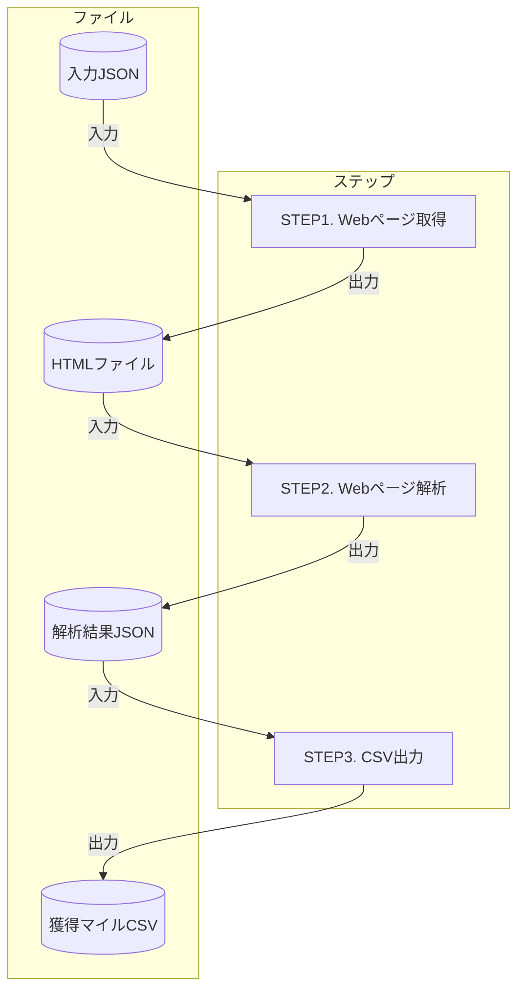

## この記事について

この記事ではWebテスト自動化フレームワークの[Playwright](https://playwright.dev/)を使ってANAの[フライトマイル・プレミアムシミュレーション](https://cam.ana.co.jp/amcmember/SimulationJaResult)のページをスクレイピングし、新潟発の国内線フライトで獲得できるマイル一覧表を作成する方法を紹介します。関連リソースを下記に示します。

- [ソースコード](https://github.com/tatsuyasusukida/playwright-ana)
- [実行結果](https://gist.github.com/tatsuyasusukida/f96228a9389603c767feab06f697e23f#file-data-csv)


## マイルについて

飛行機に乗るとマイルが貯まります。貯まったマイルは特典航空券などと交換することができます。60,000マイルくらいあるとシンガポールぐらいまでであればビジネスクラスで往復できます。どれくらいマイルが貯まるかは下記の条件で決まります。

| 条件 | 例 |
| ---- | ---- |
| 搭乗日 | 2022年8月26日 |
| 出発地 | 新潟 |
| 到着地 | 札幌(千歳) |
| 利用カード種別 | ANAカード　ゴールド |
| ANAプレミアムメンバーステイタス | ANA「ダイヤモンドサービス」（ステイタス1年目） |
| 利用運賃 | 運賃1（参考：[ANA国内線利用運賃一覧表](https://www.ana.co.jp/amcservice/pps/dom_unchin_list.html)）|

ANAのフライトマイル・プレミアムシミュレーションのページを使うと獲得マイル数を確認できます。


ANAのフライトマイル・プレミアムシミュレーションのページは便利ですが1回につき1つの条件の獲得マイル数しか確認できないため、複数条件で比較したい場合は1回1回操作する必要があるので大変です。


## やりたいこと

Playwrightを使ってWebブラウザを制御し、新潟発の国内線フライト（下記の条件）で獲得できるマイルの一覧表を出力します。

| 条件 | 内容 |
| ---- | ---- |
| 搭乗日 | 今日 |
| 出発地 | 新潟 |
| 到着地 | 札幌(新千歳)、東京(成田)、名古屋(中部)、大阪(伊丹)、大阪(関西国際)、福岡、沖縄(那覇) |
| 利用カード種別 | ANAカード　ゴールド |
| 利用運賃 | 運賃1〜13 |

フローチャートを下記に示します。



HTMLファイルと解析結果JSONの出力を省略して1つのステップで全てを処理しても良いのですが、試行錯誤の過程で何度もANAのサイトにアクセスするのは申し訳ないですし、STEP1と2（Webページ取得と解析）は処理時間が長いため、途中で中間成果物を出力するようにしています。


## コーディングの準備

ターミナルで下記のコマンドを実行してコーディングの準備をします。

```sh
mkdir playwright-ana
cd playwright-ana
npm init playwright@latest
touch tests/input.json
touch tests/fetch.spec.ts
touch tests/parse.spec.ts
touch tests/print.spec.ts
```


## コーディング

エディタで下記のファイルを開いて内容を入力します。

### tests/input.json｜入力JSON

@[gist](https://gist.github.com/tatsuyasusukida/f96228a9389603c767feab06f697e23f?file=input.json)

### tests/fetch.spec.ts｜STEP1. Webページ取得

@[gist](https://gist.github.com/tatsuyasusukida/f96228a9389603c767feab06f697e23f?file=fetch.spec.ts)

### tests/parse.spec.ts｜STEP2. Webページ解析

@[gist](https://gist.github.com/tatsuyasusukida/f96228a9389603c767feab06f697e23f?file=parse.spec.ts)

### tests/print.spec.ts｜STEP3. CSV出力

@[gist](https://gist.github.com/tatsuyasusukida/f96228a9389603c767feab06f697e23f?file=print.spec.ts)


## 動作確認

### STEP1. Webページ取得

ターミナルで下記のコマンドを実行してWebページを取得します。

```sh
npx playwright test fetch.spec.ts
```

tmp/fetchディレクトリ内にHTMLファイルが出力されていることを確認します。出力例を下記に示します。

```html
<!DOCTYPE html PUBLIC "-//W3C//DTD HTML 4.01 Transitional//EN"><html lang="ja"><head>
<meta http-equiv="Content-Type" content="text/html; charset=euc-jp">
<title>ANA SKY WEB ： ANAフライトマイル・プレミアムポイントシミュレーション</title>
<meta http-equiv="Pragma" content="no-cache">
<meta http-equiv="Cache-Control" content="no-cache">
<meta http-equiv="Expires" content="0">
<meta http-equiv="Content-Language" content="ja">
<meta http-equiv="content-style-type" content="text/css">
<meta http-equiv="content-script-type" content="text/javascript">
<meta http-equiv="X-UA-Compatible" content="IE=8">
...
```

### STEP2. Webページ解析

ターミナルで下記のコマンドを実行してWebページを解析します。

```sh
npx playwright test parse.spec.ts
```

tmp/parseディレクトリ内に解析結果のJSONファイルが出力されていることを確認します。出力例を下記に示します。

```json
{
  "input": {
    "source": { "name": "新潟", "code": "KIJ" },
    "destination": { "name": "札幌(新千歳)", "code": "CTS" },
    "card": { "name": "ANAカード　ゴールド", "code": "WID_GLD" },
    "fare": { "name": "運賃1", "code": "400_150_1" }
  },
  "output": {
    "マイル": "691",
    "フライトマイル": "553",
    "ボーナスマイル": "138",
    "区間基本マイレージ": "369",
    "クラス運賃倍率": "150%",
    "プレミアムステイタス": "25%",
    "プレミアムポイント": "1507",
    "路線倍率": "2倍",
    "搭乗ポイント": "400"
  }
},
```

### STEP3. STEP3. CSV出力

ターミナルで下記のコマンドを実行してCSVファイルを出力します。

```sh
npx playwright test parse.spec.ts
```

tmp/printディレクトリ内に獲得マイル一覧のCSVファイルが出力されていることを確認します。出力例を下記に示します。

```csv
出発地,到着地,利用カード種別,運賃,マイル,プレミアムポイント
新潟,札幌(新千歳),ANAカード　ゴールド,運賃1,691,1507
新潟,札幌(新千歳),ANAカード　ゴールド,運賃2,576,1322
新潟,札幌(新千歳),ANAカード　ゴールド,運賃3,461,1138
新潟,札幌(新千歳),ANAカード　ゴールド,運賃4,461,738
新潟,札幌(新千歳),ANAカード　ゴールド,運賃5,345,953
新潟,札幌(新千歳),ANAカード　ゴールド,運賃6,345,753
新潟,札幌(新千歳),ANAカード　ゴールド,運賃7,345,553
新潟,札幌(新千歳),ANAカード　ゴールド,運賃8,230,369
新潟,札幌(新千歳),ANAカード　ゴールド,運賃9,691,1107
```


## おわりに

Playwrightを初めて使いましたがとても使いやすくて感動しました。ヘッドレスブラウザといえば[Puppeteer](https://pptr.dev/)ですがPlaywrightはChromeだけではなくFirefoxやSafariにも対応しているのでテスト用途に向いていますね。一方、Puppeteerは歴史がある分だけググった時の情報量が多く、[Cloud Run](https://cloud.google.com/run)などでの動作実績も豊富なので画像生成やPDF出力、クローリング／スクレイピングなどテスト以外の用途に適しているように思います。なお、下記の記事でPuppeteerを使ってHTMLをPDFに変換するAPIをCloud Run上に構築する方法について紹介しているので、興味がありましたら併せてお読みいただければ幸いです。

- [PuppeteerでHTML→PDF変換 on Cloud Run](https://zenn.dev/tatsuyasusukida/articles/puppeteer-html2pdf)
