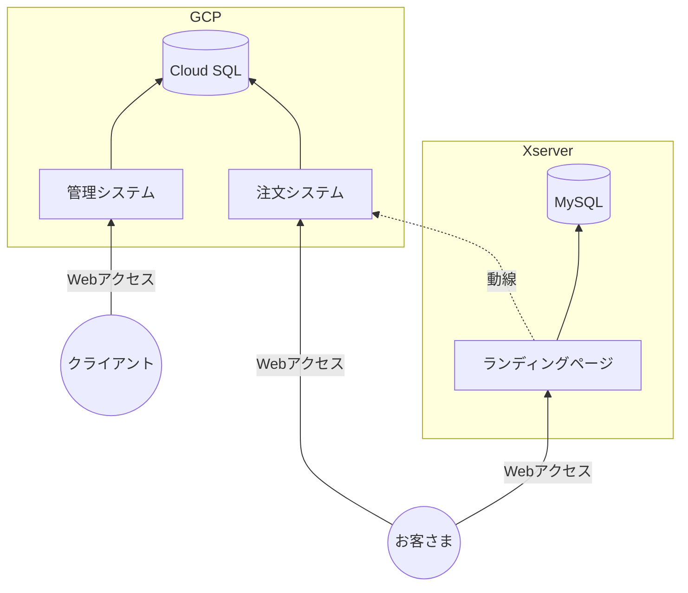
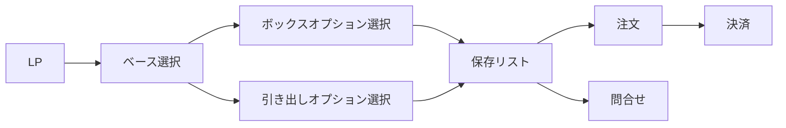

## はじめに

今からちょうど2年前くらい（2020年秋頃）に収納ボックスのカスタムオーダーECサイトの開発に関わらせてもらいました。この記事では開発を通じて得られた知見をまとめたいと思います。

## カスタムオーダーECとは何か

カスタムオーダーECの明確な定義はわかりませんが、ネットで商品を購入する時にカスタマイズできる仕様の自由度が高いECサイトだと私は考えています。カスタムオーダーECに特化したチームであるグッドベット株式会社の[カスタムオーダーEC市場を先導するおしゃれサービス31社まとめ](https://goodbet.jp/archives/8289)の記事では下記のように説明されています。

> カスタムオーダーECという言葉は、よほど興味のある方でないと聞いたことがないと思います。
> Webページ上で商品をパーツごとにカスタムしてそのままオンラインで決済・購入できるシステムのことを指します。

カスタムオーダーECの例としては下記のKnotの腕時計がわかりやすいです。

https://knot-designs.com/customorder/

## クライアントについて

クライアントは紙製品の製造や紙素材の加工を主な事業内容とする製造業の会社です。技術を活かして紙製の収納ボックスの自社商品で製造・販売をしています。紙製といっても非常に硬い特殊な紙なので強度や耐久性にも優れています。

## 課題

カスタムオーダーEC導入前は自社のWebサイトに見積依頼フォームを設置していましたが下記のような課題がありました。

- 見積依頼の都度、人手で見積書を行う必要があるので手間がかかる（見積書にはイラレで作成した商品の完成イメージを掲載している）
- 手間をかけたからといって必ずしも受注につながる訳ではない
- お客さまにとっても予算感がわからないと見積依頼の敷居が高いので受注の取りこぼしにつながっている気がする

## アプローチとシステム構成

上記の課題を解決するためにはお客さまが収納ボックスの仕様（例：寸法、取っ手などのオプション）を入力すると商品の金額と完成イメージがリアルタイムで表示されるのに加え、そのまま商品を購入できるしくみを設けることが1つのアプローチとして考えられました。このアプローチを実現するために下記のようなシステム構成のカスタムオーダーECサイトを提案しました。

ECサイトとして機能するためには注文システムと管理システムだけではなく利用ガイドやよくある質問などをまとめたLP（ランディングページ）またはWebサイトがある方が望ましいです。注文システムにLPの役割をまとめても良かったですが、LPの方は別のWebデザイナーさんが担当してくれたのでプラットフォームごと分割しました（システムはGCP、LPはXserver）。管理システムと注文システムについては私1名で開発しました。

## システム要件

注文システムに求められた要件の一部を下記に示します。

- ボックスタイプと引き出しタイプの2つの収納ボックスに対応すること
- ユーザーが仕様を入力すると商品の金額と完成イメージがほぼリアルタイムで表示されること
- 商品をショッピングカートに追加して注文／問合せができること
- クレジットカード決済ができること
- 注文／問合せ完了メールを自動送信できること

管理システムに求められた要件の一部を下記に示します。

- 注文／問合せを一覧表示／詳細表示／CSVエクスポートができること
- 注文データから工場で使用する製造仕様書の帳票出力ができること
- 価格表（商品の金額を計算するためのデータ）をExcelファイルのアップロードで更新できること
- 商品の発送完了メールの文面を自動生成できること
- 各種メールのテンプレートを編集できること

## 画面フロー

典型的な画面フローは下記の通りです。

1. ベース選択ではボックスタイプ／引き出しタイプを選択します。
2. ボックス／引き出しオプション選択では寸法などの仕様をカスタマイズします。商品の金額や完成イメージをリアルタイム表示するのがこのページです。
3. 保存リストではカート保存した商品が一覧できます。一般的にはカートページですが注文の他にも問合せというアクションもあることを理由にデザイナーさんが「保存リスト」と命名しました。
4. 注文ページでは名前や住所などを入力します。決済方法を選ぶことができ、クレジットカードの場合は外部（クロネコwebコレクト）の決済ページへ移動します。
5. 問合せページでも名前や住所などを入力します。注文とは異なり、決済方法を選ぶ必要はありません。

## 使用技術

注文システムと管理システムの開発にはExpress + Vue.js + REST + JavaScriptを使用しました。当時は最近のフロントエンドの状況を全く知らなかったので今ならNext.js + NestJS + GraphQL + TypeScriptで開発すると思います。ORMにはSequelizeを使用しましたが今ならPrismaを使用すると思います。

Webホスティング + APIにはGCPのCloud Run、データベースには同じくGCPのCloud SQL、メール送信にはSendGridを使用しました。今でもこれらのサービスを選定すると思いますがSPAにしてWebホスティングにCloudflare Pagesを使ってみるのも面白そうです。

クレジットカード決済にはクロネコwebコレクトのリンク方式を使いました。Stripeを使いたかったですがクライアントから指定があったので断念しました。クロネコwebコレクトもドキュメントが豊富だったので開発がしやすくて良かったです。

ちなみにLPの制作にはWordPressが使用されました。

## 実装のポイント

書きたいことが色々ありますが下記3点について紹介します。

1. 商品の完成イメージ生成
2. 商品金額の計算
3. 製造上の制約に応じたバリデーション

### 商品の完成イメージ生成

これが一番大変でした。ユーザーが入力した寸法などの仕様を入力としてSVGを出力する処理をサーバーサイドで実装しました。画像としてダウンロードできるようにするためにSVGをPNGに変換しています。

頭を使って何かを工夫したというよりも気合と力技でした。取っ手やキャスターのSVGコードを手入力するのは本当に大変の作業でした。その時に培った(?)知見は下記の記事にまとめられています。

- [SVGで原点を中心かつY軸を上向きにする方法](https://zenn.dev/tatsuyasusukida/articles/svg-origin-center)
- [JavaScriptでSVGをPNGに変換する方法](https://zenn.dev/tatsuyasusukida/articles/javascript-svg-png)

### 商品金額の計算

データベースに登録された価格表（商品仕様と金額の対応表）からユーザーが入力した仕様に応じて算定の基礎となる金額を拾い、それらを加減乗除することで商品金額を計算しています。

例えば箱、取っ手、キャスターの価格が下記だったと仮定します。

| 幅(W) | 高さ | 奥行(D) | 箱の金額 |
| ---- | ---- | ---- | ---: |
| 100〜200mm | 100〜200mm | 100〜200mm | ￥5,000 |

| 取っ手の種類 | 取っ手の金額 |
| ---- | ---: |
| なし | ￥0 |
| 小取っ手 | ￥200 |
| 大取っ手 | ￥400 |

| キャスターの種類 | キャスターの金額 |
| ---- | ---: |
| なし | ￥0 |
| 固定キャスター | ￥400 |
| 可動キャスター | ￥600 |

ユーザーが入力した仕様が下記だったと仮定します。

- 箱の寸法：全て150mm
- 取手：小取っ手（2個｜正面と背面に1個ずつ）
- キャスター：固定キャスター（4個）

この場合の商品金額は7,000円であり、内訳は下記の通りです。

| 品名 | 単価 | 数量 | 金額 |
| ---- | ---: | ---: | ---: |
| 箱 | ￥5,000 | 1箱 | ￥5,000|
| 小取っ手 | ￥200 | 2個 | ￥400|
| キャスター | ￥400 | 4個 | ￥1,600|

### 製造上の制約に応じたバリデーション

物理的に製造できない仕様の組み合わせがあります。一例として収納ボックスの場合、寸法が一定より小さければキャスターや取っ手をつけられません。製造できない仕様の組み合わせで注文／問合せをして後から「できません」と連絡が来るのはユーザーの購入体験を著しく損ないます。特に注文でクレジットカード決済を利用している場合は返金が必要なので手数料の損害が発生します。このような理由から製造できる仕様でのみ注文／問合せができるように入力値検査（バリデーション）を実装する必要があります。

考え方は商品金額の計算と価格表と同じように対応表を使いました。対応表の一例を下記に示します。

| 幅(W) | 高さ | 奥行(D) | 取っ手の種類 | 選択できる? |
| ---- | ---- | ---- | ---- | ---- |
| 100〜200mm | 100〜200mm | 100〜200mm | 小取っ手 | true |
| 100〜200mm | 100〜200mm | 100〜200mm | 大取っ手 | false |

実際には取っ手を1面につき2個つけるなどのパターンもあり対応表はもっと複雑でした。

## 開発費用を低く抑えるための工夫

クレジットカード決済の機能をシステム要件から外せたら開発費用を低く抑えられそうだと開発が終わってから感じました。ECサイトなのでシステム上でクレジットカード決済できることが理想ですがメールリンク型決済（後から手動でクレジットカード決済URLを記載したメールを送付する方法）を使えば実装とテストに要する費用を大幅に削減することができます。

カスタムオーダーECサイトではシステム上でクレジットカード決済ができることよりも商品の金額や完成イメージがリアルタイムで表示されることが重要なのではないかと思います。でも実案件ではクレジットカード決済が結局のところほぼ必須で求められそうな気がします…

## 開発の期間・費用

開発期間は2.5カ月間、開発費用は200万円程度でした。同じような規模のカスタムオーダーECサイトの開発費用の相場は400〜500万円くらいだと思いますが、下記のような理由から半額程度の費用で開発を受託しました。

- 補助金活用事業だったので支払可能な上限が決まっていた
- 自分が挑戦したことのない分野だったので経験を積みたかった
- お客さま（委託者）が発注前に仕様を入念にチェックしてくれたので手戻りのリスクが低かった
- お客さま（委託者）が私に対して一介の下請け企業ではなく1人の専門家として親切丁寧に接してくれたので報いたかった

## デモ

あまり良くできてなくて恥ずかしいのですがカスタムオーダーECの注文サイトのデモを作成しました。さすがに商品が収納ボックスだとクライアントに申し訳ない気がしたのでオーダーメイド本棚にしました。

- [注文システムのデモ](https://shelf-public.loremipsum.co.jp/)
- [管理システムのデモ](https://shelf-admin.loremipsum.co.jp/)

ソースコードも下記に公開しています。

- [注文システムのソースコード](https://github.com/tatsuyasusukida/shelf-public)
- [管理システムのソースコード](https://github.com/tatsuyasusukida/shelf-admin)
- [描画システムのソースコード](https://github.com/tatsuyasusukida/shelf-render)

## おわりに

先日、先輩に[ビザスクlite](https://service.visasq.com/)というスポットコンサルのマッチングサービスを教えてもらいました。早速ユーザー登録を行い、話せるトピックとしてカスタムオーダーECサイト開発を登録しました。トピックを登録する際に「話せること」として2000文字くらいのテキストを書いたのですが、もう少しテキストを足したらちょうど良いボリュームになるのではないかと思いこの記事を作成しました。

カスタムオーダーECサイトの開発は初めてでしたが貴重な経験を積めて嬉しかったです。クライアントも本当に素晴らしい方々だったので開発に関わらせてもらったことには感謝しかありません。最後になりますがこの記事がどなたかの役に立てば幸いです。
