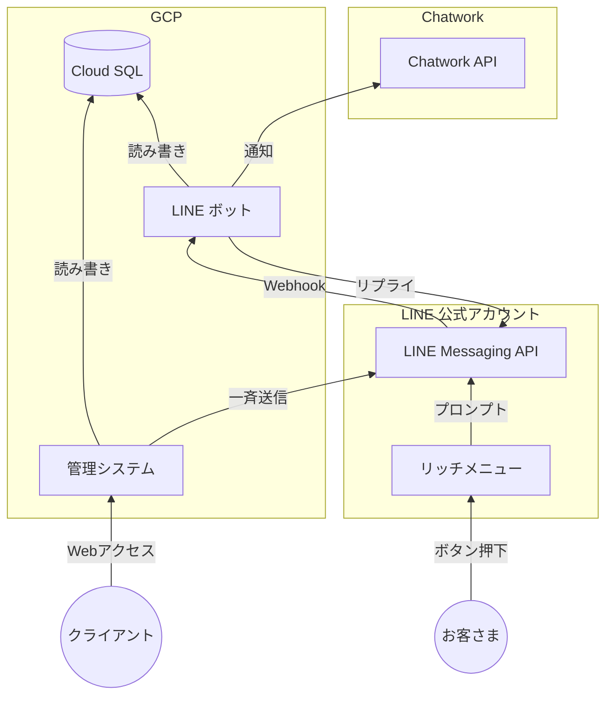
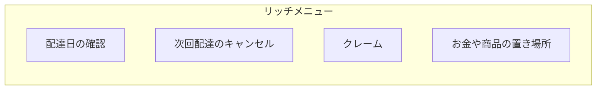

## はじめに

今年の 2 月頃から定期配達サービスのお問い合わせ対応自動化 LINE ボット開発に関わらせてもらいました。この記事では開発を通じて得られた知見をまとめたいと思います。

## クライアントについて

クライアントは生花の定期配達を主な事業内容とする小売業の会社です。全国展開はしておらず、自社の配達スタッフが近隣エリアに直接お届けしています。配達の頻度は 2 週間に 1 回であり、ルート配送している都合でエリアによって配達する曜日が固定されています。お客さまは配達日の 4 日前までなら無料でキャンセル可能です。

## 課題

クライアントはお客さまとのやり取りを電話と LINE で行っていますが下記のような課題がありました。

- 配達日確認やキャンセルなどのお問い合わせが頻繁にあるので手間がかかる。
- 配達スタッフの都合などで配達日に変更が生じた場合に影響のあるお客さん全員に個別連絡するのが大変。

### よくあるお問い合わせ

クライアントからヒアリングした結果、よくあるお問い合わせについては下記の通りでした。

- 配達日の確認
- 次回配達のキャンセル
- クレーム（例：花が痛んでいた、商品が届いていない）
- お金や商品の置き場所

## アプローチとシステム構成

上記の課題を解決するために下記 2 つのしくみを設けることがアプローチの 1 つとして考えられました。

- お客さまからのよくあるお問い合わせに対して自動応答するしくみ
- 複数のお客さまにメッセージを一斉送信するしくみ

このアプローチを実現するために下記のようなシステム構成のお問い合わせ対応自動化 LINE ボットを提案しました。

### リッチメニュー

リッチメニューは LINE 公式アカウントのトーク画面下部に表示されるメニュー画像です。お客さまがリッチメニュー内のボタンを押すと「> 配達日の確認」などのプロンプトが送信されます。リッチメニューはお客さまが LINE ボットを利用するためのエントリーポイントになります。例を下記に示します。

_リッチメニュー画像の例（[LINE 公式ドキュメント](customer-support-automation-line-bot-development)より引用）_

### Chatwork 通知

LINE ボットとお客さまのやり取りは LINE 公式アカウント管理画面のチャットページからも確認できますが、次回配達のキャンセルやクレームなどのお問い合わせがあった時は別途通知がある方が便利です。通知の方法はメールや Slack でも良かったですがクライアントの希望で Chatwork になりました。

## システム要件

今回の開発で求められた要件の一部を下記に示します。

### LINE ボット

- 当月と次月の配達日をカレンダーで確認できること。
- 次回と次々回の配達をキャンセルできること。
- キャンセルすると配達日カレンダーへ即座に反映されること。
- 配達キャンセルの取り消しはできないこと（配達日の直前だと対応できないケースがあるため）。
- クレームについては「花が傷んでいた」「商品が届いていない」などをボタン押下で送信できること。
- お金の置き場所については「ポストの中」「牛乳箱の中」などをボタン押下で送信できること。
- 商品の置き場所については「傘立て」「玄関前」などをボタン押下で送信できること。
- クレームと置き場所では「その他」ボタンを設けてお客さまが内容を LINE メッセージとして入力できること。
- 「その他」の内容をお客さまが入力・送信した時に受付メッセージを返信すること。
- お問い合わせがあった時に Chatwork に通知されること（ただし配達日の確認は除く）。

### 管理システム

- お客さまの LINE ID と配達日のデータを Excel でインポート／エクスポートできること。
- お客さまの LINE ID を複数指定してメッセージを一斉送信できること。

## 画面フロー

### リッチメニュー

リッチメニューは下記 4 つのボタンから構成されています。

- 配達日の確認
- 次回配達のキャンセル
- クレーム
- お金や商品の置き場所

お客さまが各ボタンを押すと「> 配達日の確認」のようなプロンプトがお客さまの LINE メッセージとして送信されます。

リッチメニューのイメージを下記に示します（実際にはボタンは 2 行 2 列で配置されます）。

### 配達日の確認

LINE ボットは「> 配達日の確認」のプロンプトを受信すると配達日のカレンダーを返信します。カレンダーの生成には下記の記事を参考にして [Flex Message](https://developers.line.biz/ja/docs/messaging-api/using-flex-messages/) を使いました。

https://qiita.com/7kaji/items/69c790efc9ed8813fe73

_上記の記事より引用_
