## はじめに

今年の 2 月頃から定期配達サービスのお問い合わせ対応自動化 LINE ボット開発に関わらせてもらいました。この記事では開発を通じて得られた知見をまとめたいと思います。

## クライアントについて

クライアントは生花の定期配達を主な事業内容とする小売業の会社です。全国展開はしておらず、自社の配達スタッフが近隣エリアに直接お届けしています。配達の頻度は 2 週間に 1 回であり、ルート配送している都合でエリアによって配達する曜日が固定されています。お客さまは配達日の 4 日前までなら無料でキャンセル可能です。

## 課題

クライアントはお客さまとのやり取りを電話と LINE で行っていますが下記のような課題がありました。

- 配達日確認やキャンセルなどのお問い合わせが頻繁にあるので手間がかかる。
- 配達スタッフの都合などで配達日に変更が生じた場合に影響のあるお客さん全員に個別連絡するのが大変。

### よくあるお問い合わせ

クライアントからヒアリングした結果、よくあるお問い合わせについては下記の通りでした。

- 配達日の確認
- 次回配達のキャンセル
- クレーム（例：花が痛んでいた、商品が届いていない）
- お金や商品の置き場所

## アプローチとシステム構成

上記の課題を解決するために下記 2 つのしくみを設けることがアプローチの 1 つとして考えられました。

- お客さまからのよくあるお問い合わせに対して自動応答するしくみ
- 複数のお客さまにメッセージを一斉送信するしくみ

このアプローチを実現するために下記のようなシステム構成のお問い合わせ対応自動化 LINE ボットを提案しました。

### リッチメニュー

リッチメニューは LINE 公式アカウントのトーク画面下部に表示されるメニュー画像です。お客さまがリッチメニュー内のボタンを押すと「> 配達日の確認」などのプロンプトが送信されます。リッチメニューはお客さまが LINE ボットを利用するためのエントリーポイントになります。例を下記に示します。

_リッチメニュー画像の例（[LINE 公式ドキュメント](customer-support-automation-line-bot-development)より引用）_

### Chatwork 通知

LINE ボットとお客さまのやり取りは LINE 公式アカウント管理画面のチャットページからも確認できますが、次回配達のキャンセルやクレームなどのお問い合わせがあった時は別途通知がある方が便利です。通知の方法はメールや Slack でも良かったですがクライアントの希望で Chatwork になりました。

## システム要件

今回の開発で求められた要件の一部を下記に示します。

### LINE ボット

- 当月と次月の配達日をカレンダーで確認できること。
- 次回と次々回の配達をキャンセルできること。
- キャンセルすると配達日カレンダーへ即座に反映されること。
- 配達キャンセルの取り消しはできないこと（配達日の直前だと対応できないケースがあるため）。
- クレームについては「花が傷んでいた」「商品が届いていない」などをボタン押下で送信できること。
- お金の置き場所については「ポストの中」「牛乳箱の中」などをボタン押下で送信できること。
- 商品の置き場所については「傘立て」「玄関前」などをボタン押下で送信できること。
- クレームと置き場所では「その他」ボタンを設けてお客さまが内容を LINE メッセージとして入力できること。
- 「その他」の内容をお客さまが入力・送信した時に受付メッセージを返信すること。
- お問い合わせがあった時に Chatwork に通知されること（ただし配達日の確認は除く）。

### 管理システム

- お客さまの LINE ID と配達日のデータを Excel でインポート／エクスポートできること。
- お客さまの LINE ID を複数指定してメッセージを一斉送信できること。

## 画面フロー

### リッチメニュー

リッチメニューは下記 4 つのボタンから構成されています。

- 配達日の確認
- 次回配達のキャンセル
- クレーム
- お金や商品の置き場所

リッチメニューのイメージを下記に示します（実際にはボタンは 2 行 2 列で配置されます）。

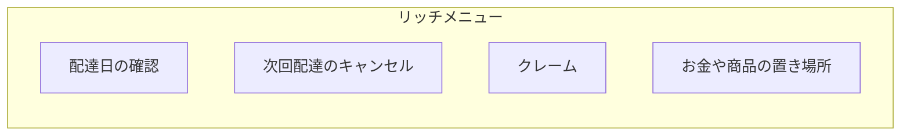

お客さまがボタンを押すと「> 配達日の確認」のようなプロンプトがお客さまの LINE メッセージとして送信されます。LINE ボットはプロンプトを受信するとメッセージ返信などのシーケンスを実行します。

### 配達日の確認

LINE ボットが「> 配達日の確認」プロンプトを受信した場合のシーケンス図を下記に示します。

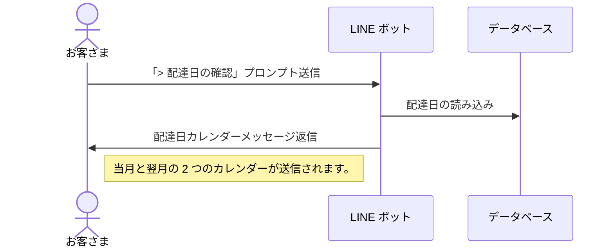

カレンダー生成には下記の記事を参考にして [Flex Message](https://developers.line.biz/ja/docs/messaging-api/using-flex-messages/) を使いました。

https://qiita.com/7kaji/items/69c790efc9ed8813fe73

_Flex Message を使ったカレンダーメッセージの例（上記の記事より引用）_

### 配達日のキャンセル

LINE ボットが「> 次回配達のキャンセル」プロンプトを受信した場合のシーケンス図を下記に示します。

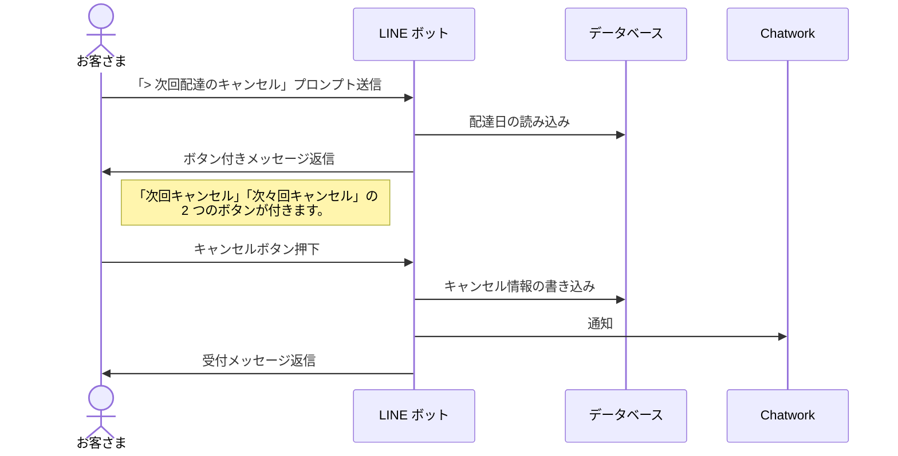

配達キャンセルが受付済みの場合はデータベースへのキャンセル情報の書き込みと Chatwork への通知は行わず、下記のような受付メッセージを返信して案内します。

> ● 月 ● 日の配達キャンセルについては既に受付が完了しています。配達キャンセルを取り消す場合はトークにてお知らせください。

### クレーム

LINE ボットが「> クレーム」プロンプトを受信した時のシーケンス図を下記に示します。

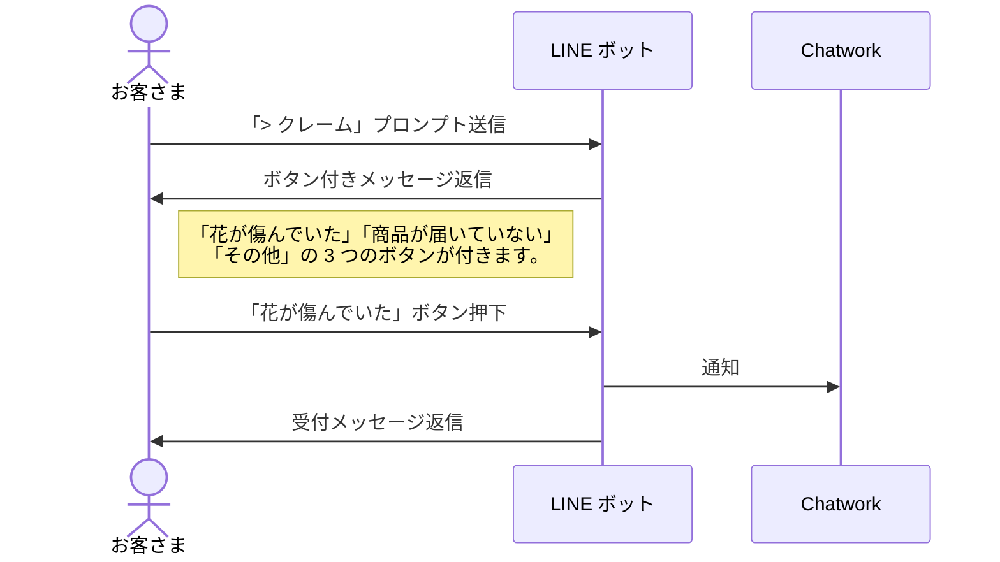

お客さまが「その他」ボタンを押した場合のシーケンスはもう少し複雑です。

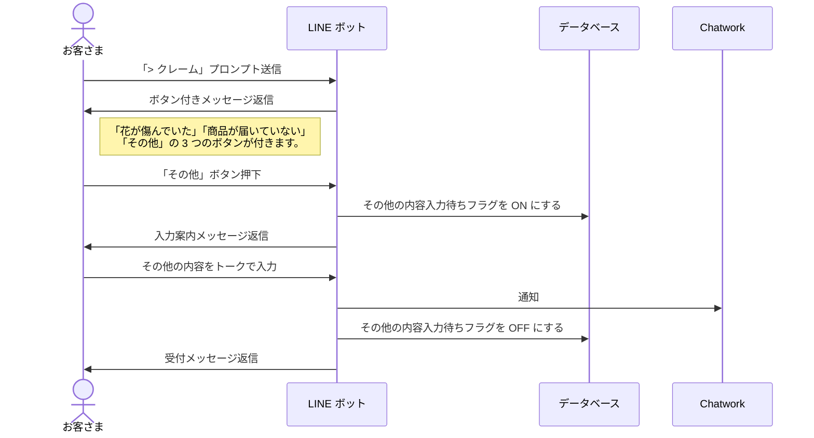

その他の内容入力待ちフラグが ON の状態でお客さまからトークを受信した場合、LINE ボットは「お客さまからその他の内容が入力された」と見なしてその後のシーケンスを実行します。

### お金や商品の置き場所

LINE ボットが「> お金や商品の置き場所」プロンプトを受信した時のシーケンス図を下記に示します。

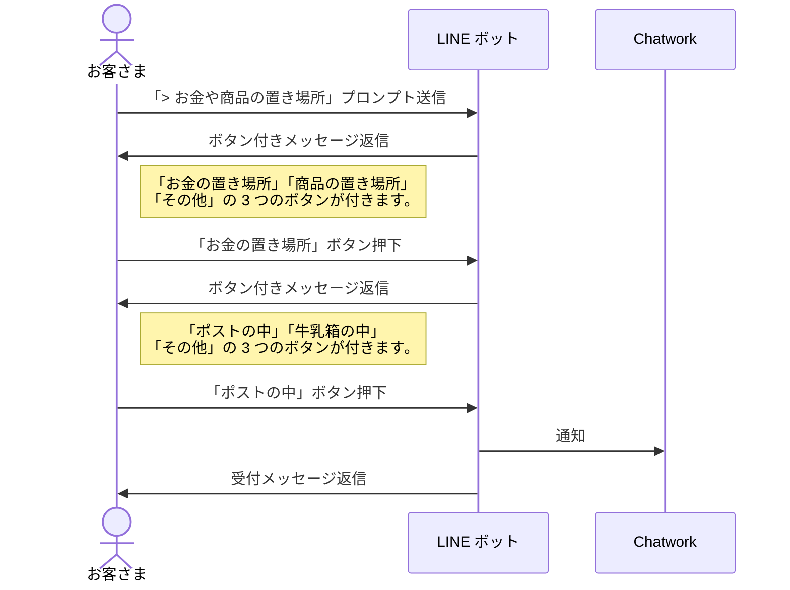

「> お金の置き場所」プロンプトと「> 商品の置き場所」プロンプトの 2 つに分けても良かったかも知れませんが、リッチメニューのデザインの関係でボタンが 4 つだと収まりが良かったのでプロンプトを 1 つにまとめることにしました。

お客さまが「その他」ボタンを押した場合のシーケンスについては「> クレーム」プロンプトの場合と同じように対処しています。

## 使用技術

### LINE ボット

LINE ボットの開発には NestJS + Prisma + TypeScript を使用しました。LINE ボットは Webhook 開発になるので Web サーバーを開発できるプログラミング言語やフレームワークであれば何でも利用可能です。

LINE Messaging API については公式 SDK が提供されており、主に TypeScript の型定義を使わせてもらいました。

https://github.com/line/line-bot-sdk-nodejs

Chatwork API については SDK などは提供されていませんでしたが、API がシンプルなので公式ドキュメントを読んですぐに利用できました。

https://developer.chatwork.com/docs

### 管理システム

管理システムの開発には Next.js + Prisma + TypeScript を使用しました。要件に Excel インポート／エクスポートがあったので xlsx という npm パッケージを使って実装しましたが、なかなクセが強くて苦労しました。

https://www.npmjs.com/package/xlsx

### 運用環境

LINE ボットと管理システムの Web ホスティングには Cloud Run、データベースには GCP の Cloud SQL を使いました。NestJS と Next.js はいずれも Cloud Run のソースコードからのデプロイ機能に対応していてコマンド 1 つで公開や更新ができるので楽でした。

https://cloud.google.com/run/docs/deploying-source-code?hl=ja

## 開発のポイント

### 技術検証

LINE Messaging API と Chatwork API については使用するのが初めてだったので要件定義前に手を動かして試してみました。検証を通じてできないことや制約などを理解した上で設計・実装ができたのでスムーズに開発が進んだように感じます。検証の過程については下記の Zenn スクラップに記録していきました。

https://zenn.dev/tatsuyasusukida/scraps/bf35b2746f549e

https://zenn.dev/tatsuyasusukida/scraps/ddd6943976df8a

### テスト

LINE ボットはテストコードからプロンプトを受け取ると返信メッセージを LINE Messaging API に送信し、テストコードには HTTP の 200 OK レスポンスを返します。

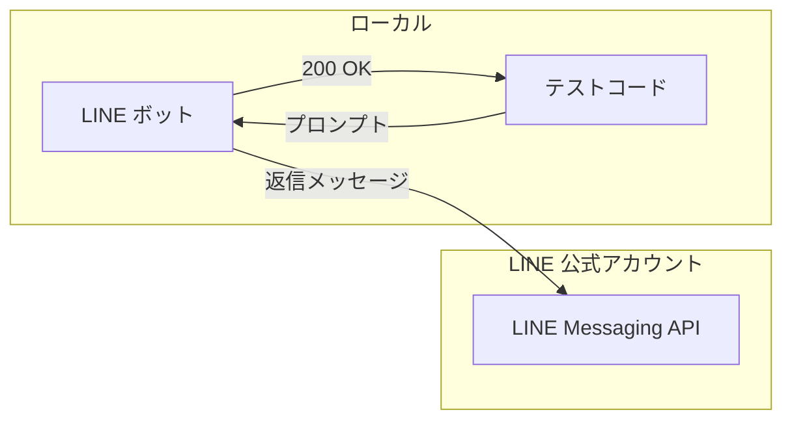

このままだとテストしにくかったので LINE ボットにテストモード機能を設けて返信メッセージをテストコードに返すようにしました。なお、テストモードの ON / OFF は環境変数で切り替えられるようにしました。

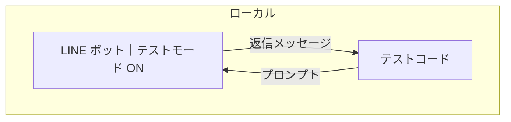

### 友だち一覧の出力

クライアントからの要望で LINE 友だち登録済みのお客さまは ID 連携なしですぐに LINE ボットを使えるようにすることが求められました。そのためには LINE 公式アカウントの友だち一覧（お客さまの氏名と LINE ID の対応表）を出力する必要があり、この作業になかなか苦戦しました。この作業で得られた知見については下記の記事にまとめました。

https://zenn.dev/tatsuyasusukida/articles/line-friend-export

## 実装前に知っておきたかったこと

### ngrok

ngrok はローカルのサーバーを外部に公開できるサービスです。ngrok を使うとローカルでは行えない Webhook の動作確認ができるようになります。

https://ngrok.com/

Cloudflare Tunnel という同じようなサービスもあります。

https://www.cloudflare.com/ja-jp/products/tunnel/

今回はその都度 GCP にデプロイしていたのでトライ＆エラーに時間がかかっていました。次に Webhook 開発をする時はどちらかを使ってみようと思います。

### マルチキャストメッセージ

LINE Messaging API では下記 5 つのメッセージタイプがあります。

- 応答メッセージ
- プッシュメッセージ
- マルチキャストメッセージ
- ナローキャストメッセージ
- ブロードキャストメッセージ

上記のうち LINE ID を指定してメッセージを送信できるのは 2 番目のプッシュメッセージと 3 番目のマルチキャストメッセージです。前者のプッシュメッセージは 1 人のユーザーに低遅延でメッセージを送るのに適しています。一方、後者のマルチキャストメッセージは複数のユーザーに同じメッセージを送るのに適しています。

https://developers.line.biz/ja/reference/messaging-api/#send-multicast-message

管理システムにメッセージ一斉送信の機能を実装するのにプッシュメッセージを使いましたが、明らかにマルチキャストメッセージを使うべきユースケースでした。次の機会があればマルチキャストメッセージを使おうと思います。

## 開発コストを安くするための工夫

### テキスト入力には Web フォームを使う

今回の開発ではお客さまがテキストを入力するのにトークを使いましたが、そのためにはセッション情報（例：その他の内容入力待ちフラグ）を保存しておく必要があるので実装・テストに手間がかかります。トークの代わりに Web フォームを設置し、Web フォームへアクセスするボタン付きメッセージをお客さまに送ることで開発コストを安くできそうだと感じました。ただし、お客さまによっては LINE 内で完結したいニーズもあるかもしれないのでケースバイケースかも知れません。

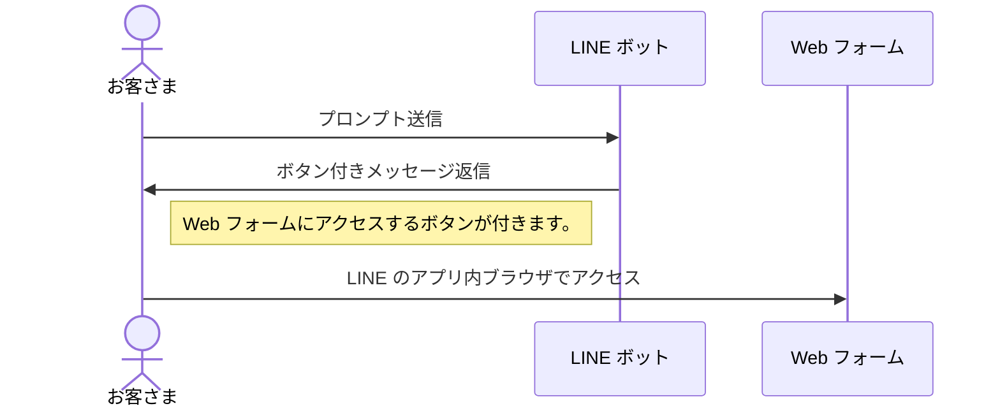

### 管理者側で ID 連携する

お客さま側で ID 連携を行えるようにするには何らかの会員システム（例：EC サイト）が必要になりますが、新規に構築したり既存の会員システムに ID 連携機能を追加したりするとお金も時間もかかります。お客さまの数が少ない場合はトークで本人確認 + LINE ID 取得を行い、管理者側でお客さまの LINE ID と顧客情報を紐付けする作業を行う方が開発コストを安くできそうだと感じました。

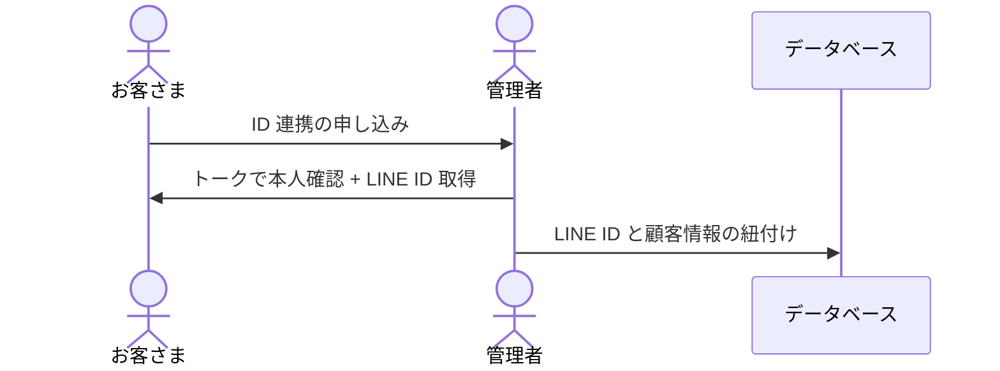

仮に ID 連携のしくみを設けたとしてもお客さまによってはログインでつまづくなどして ID 連携に失敗するケースもあります。このような時でもフォローできるように管理者側で ID 連携する機能は設けておいた方が良いかもしれません。

## 運用コストを安くするための工夫

### 応答メッセージを使う

前述のように LINE Messaging API では 5 つのメッセージタイプがあります。この中でも応答メッセージは無料で送信できますが、それ以外のメッセージを送信する場合は（規模にもよりますが）実質的に有料プランの契約が必要になります。

https://www.lycbiz.com/jp/service/line-official-account/plan/

キャンペーン告知やクーポン配布などマーケティング目的にも LINE 公式アカウントを使う場合は良いですが、重要度がそれほど高くない通知を LINE ボットから送信するためだけに有料プランを契約するのは少しもったいない感じがします。許容できるのであれば通知をプル型にするなど設計を工夫して LINE ボットからは応答メッセージだけを送信すれば有料プランの契約が不要になるので運用コストを安くできそうだと感じました。

## 開発の期間・費用

開発期間は 3.5 カ月間、開発費用は 180 万円程度でした。開発期間の内訳については下記ガントチャートの通りです。

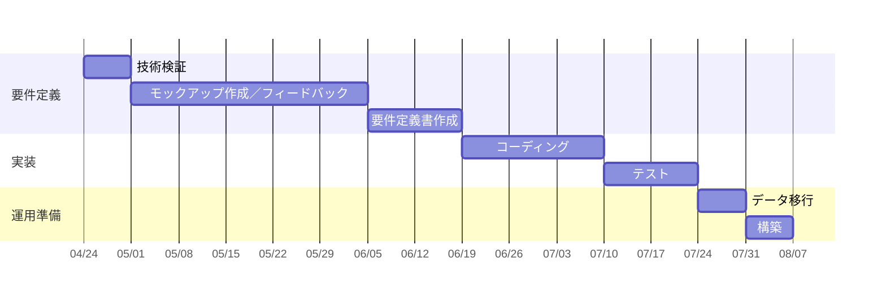

初めての LINE ボット開発だったので要件定義に 2 カ月間とやや長めの期間を要しました。次回は経験値が増えているので 1〜1.5 カ月くらいに短縮できたらいいなと思います。

開発費用については同じような規模の LINE ボット開発する場合の相場は 200〜300 万円くらいだと思いますが、下記のような理由から割安の費用で開発を受託しました。

- はじめての LINE 開発だったので経験を積みたかった。
- ID 連携を管理者側で手動で行うことにした。
- クライアントの予算の関係で管理システムの機能を削減した。

## おわりに
