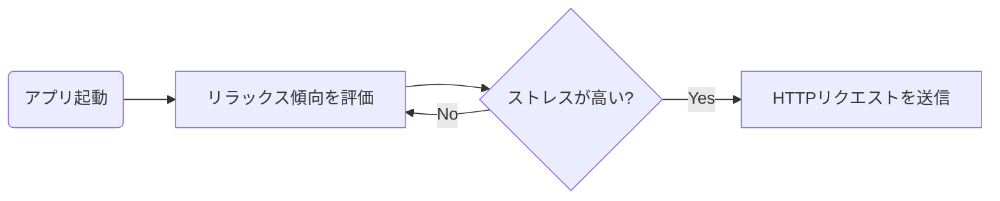
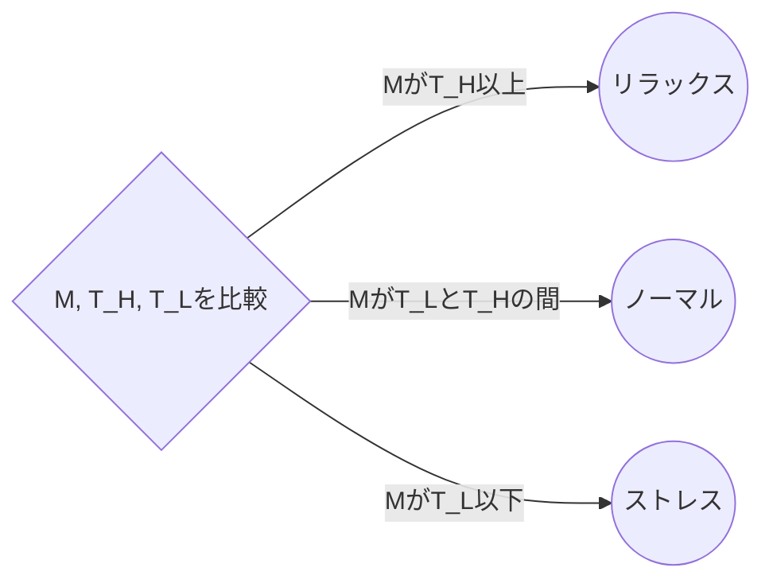
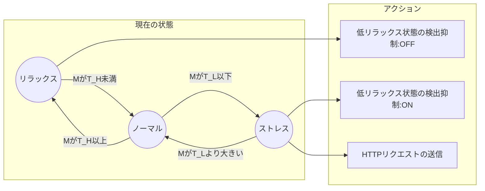
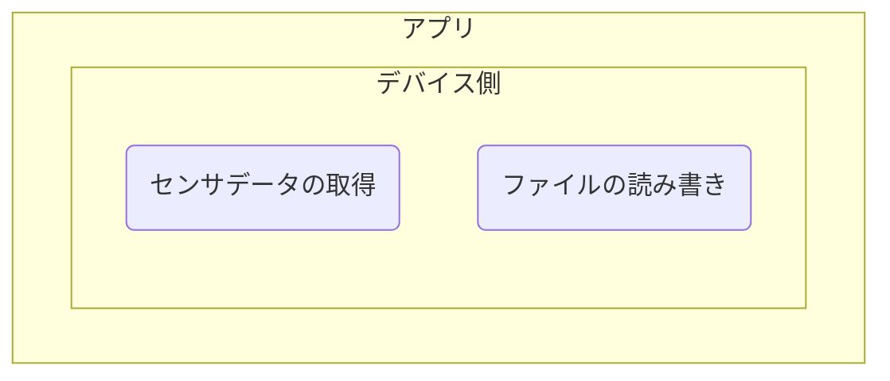
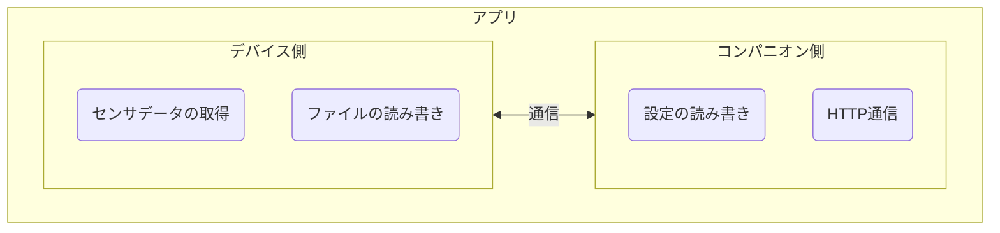

## はじめに

先月の2022年11月15日(火)にHeart Rate Switch（心拍スイッチ）という名前でFitbitアプリをリリースしました。Fitbit Galleryに無料アプリとして登録しており、スマートフォンから下記のページにアクセスしてインストール可能です。

https://gallery.fitbit.com/details/989e530e-c44d-448d-8afe-653f4c59a179

アプリのソースコードについてはGitHubで公開しており、MITライセンスで利用可能です。

https://github.com/tatsuyasusukida/heartrate-switch

この記事ではアプリの機能と実装に利用したAPIについて紹介します。


## アプリの機能

### このアプリは何か？

心拍スイッチは心拍数データからリラックス傾向を評価し、ストレスが高い状態になった時にHTTPリクエストを送信するFitbitアプリです。[IFTTT](https://ifttt.com/)のようなIoTサービスと組み合わせて使うことにより、例えばストレスが高い状態になった時にスマートスピーカーで音楽を再生することができます。



### リラックス傾向の評価

リラックス傾向の評価には[心電図RR間隔のローレンツプロットによる副交感神経活動の簡易推定法の開発](https://www.jstage.jst.go.jp/article/jje1965/43/4/43_4_185/_pdf)の論文を参考にしました。リラックス傾向を$M$、心拍数データのサンプル数を$N$、心拍数データのサンプルを$h_1, h_2, ..., h_N$として次の数式を使って評価しています。

$$M = \sqrt{c_x^2 + c_y^2}$$

ここで$c_x = t_1 + t_2 + ... + t_{N-1}$、$c_y = t_2 + t_3 + ... + t_N$、$t_n = 60 / h_n$です。

### 設定

ユーザーは下記5点を設定することができます。

- 心拍数データの保持期間[秒]
- 高リラックス状態の閾値｜$T_H$
- 低リラックス状態の閾値｜$T_L$
- 低リラックス状態検出時のHTTPリクエスト送信のON/OFF
- HTTPリクエストのURL


### 状態遷移

このアプリはリラックス状況$M$、高リラックス状態の閾値$T_H$、低リラックス状態の閾値$T_L$から現在の状態がリラックス、ノーマル、ストレスのいずれであるかを次の基準で判定します。

- もし$M \ge T_H$ならばリラックス
- もし$T_H \lt M \lt T_L$ならばノーマル
- もし$M \le T_L$ならばストレス



### HTTPリクエストの送信

現在の状態がノーマルからストレスに変わった時、低リラックス状態を検出してHTTPリクエストを送信します。HTTPリクエストの送信が短時間に何度も行われることを防ぐため、低リラックス状態を1回検出するとその後の検出を抑制します。現在の状態がノーマルからリラックスに変わった時、低リラックス検出の抑制を解除します。



### 画面

デバイスの画面には下記7点が表示されます。

- 現在のリラックス傾向
- 高リラックス状態の閾値
- 定リラックス状態の閾値
- 心拍数データの保持期間
- 低リラックス検出時のHTTPリクエスト送信のON/OFF
- ストレス状態の検出回数


## 実装に利用したAPI

### アーキテクチャ

Fitbitアプリのコードはデバイス側（Fitbit本体）とコンパニオン側（スマートフォン）と大きく2つに分けられ、デバイス側とコンパニオン側では利用できるAPIが異なります。一例を下記に示します。

- デバイス側で利用できるAPI
  - 加速度や心拍数などのセンサデータの取得
  - ファイルの読み書き
- コンパニオン側で利用できるAPI
  - 設定の読み込み
  - HTTP通信

コンパニオン側のコードはあってもなくても良いので、センサデータの取得やファイルの読み書きだけが必要な場合はコンパニオン側のコードを無くしてデバイス側のコードだけでスタンドアロンで動かすことができます。イメージを下記に示します。



一方、設定の読み込みやHTTP通信も必要な場合はコンパニオン側とデバイス側の両方のコードが必要となります。また、コンパニオン側とデバイス側で通信を行う必要があります。イメージを下記に示します。



今回のアプリは設定の読み込みやHTTP通信を必要とするものだったのでコンパニオン側とデバイス側の両方のコーディングを行いました。

### 起動したままにする

Fitbitアプリは操作しない状態が2分間以上続くと自動的に終了します。これを無効化するにはデバイス側で[Appbit API](https://dev.fitbit.com/build/reference/device-api/appbit/)を使用します。

```js:app/index.js
import { me as appbit } from "appbit";
appbit.appTimeoutEnabled = false;
```

### 設定の読み込み

Fitbitアプリに設定機能を設けるには下記の4つのステップを行います。

1. 設定画面の作成
2. 設定データの読み込み
3. 設定データの送信
4. 設定データの受信

設定画面を作成するにはコンパニオン側でReactコンポーネントを作成して登録します。登録するには`registerSettingsPage`関数を呼び出します。

```js:settings/index.jsx
function HelloWorld(props) {
  return (
    <Page>
      <TextInput label="心拍数データの保持期間[秒]" placeholder="例：600" settingsKey="retentionPeriod" type="number"/>
      <TextInput label="高リラックス状態の閾値" placeholder="例：1.2" settingsKey="thresholdHigh" type="number"/>
      <TextInput label="低リラックス状態の閾値" placeholder="例：0.8" settingsKey="thresholdLow" type="number"/>
      <Toggle settingsKey="sendHttp" label="低リラックス検出時のHTTPリクエスト送信"/>
      <TextInput label="HTTPリクエストのURL" placeholder="例：https://example.com/api" settingsKey="sendUrl" type="url" disabled={!(props.settings.sendHttp === 'true')}/>
    </Page>
  );
}

registerSettingsPage(HelloWorld);
```

設定データを読み込むにはコンパニオン側で[Settings API](https://dev.fitbit.com/build/reference/companion-api/settings/)を使用します。

```js:companion/index.js
import { settingsStorage } from "settings";
const item = settingsStorage.getItem("myKey");
```

設定データをデバイス側へ送信するにはコンパニオン側で[Messaging API](https://dev.fitbit.com/build/reference/companion-api/messaging/)を使用します。

```js:companion/index.js
import { peerSocket } from "messaging";

if (peerSocket.readyState === peerSocket.OPEN) {
   peerSocket.send(data);
}
```

設定データを受信するにはデバイス側で[Messaging API](https://dev.fitbit.com/build/reference/device-api/messaging/)を使用します。

```js:app/index.js
import { peerSocket } from "messaging";

messaging.peerSocket.addEventListener("message", onMessage);

function onMessage(event) {
  if (event && event.data) {
    console.log(event.data);
  }
}
```

### ファイルの読み書き

Fitbitアプリでは例えばスマートフォンのBluetoothがOFFになっているなどの理由でデバイスとコンパニオンの間で通信できない状況があります。このような状況でもアプリを動作可能にするには、設定データなど動作に必要な情報をデバイス側でファイルに保存する方法が考えられます。

ファイルを読み書きするにはデバイス側で[File System API](https://dev.fitbit.com/build/reference/device-api/fs/)を使います。

```js:app/index.js
import * as fs from "fs";

function readSettings() {
  if (fs.existsSync("settings.json")) {
    return fs.readFileSync("settings.json", "json");
  }
}

function writeSettings(settings) {
  fs.writeFileSync("settings.json", settings, "json");
}
```

### 心拍数の取得

心拍数を取得するにはデバイス側で[Heart-rate API](https://dev.fitbit.com/build/reference/device-api/heart-rate/)を使用します。

```js:app/index.js
import { HeartRateSensor } from "heart-rate";

const hrm = new HeartRateSensor({ frequency: 1 });
hrm.addEventListener("reading", onReading);
hrm.start();

function onReading() {
  const { heartRate } = hrm;

  if (!heartRate) {
    return;
  }

  console.log(heartRate);
}
```

Heart-rate APIを使用するにはpackage.jsonでパーミッションを設定する必要があります。

```json:package.json
{
  "fitbit": {
    "requestedPermissions": [
      "access_heart_rate"
    ]
  }
}
```

### HTTPリクエストの送信

HTTPリクエストを送信するにはコンパニオン側で[Fetch API](https://dev.fitbit.com/build/reference/companion-api/fetch/)を使用します。

```js:app/index.js
const response = fetch(url, {
  method: "POST",
  headers: {
    "Content-Type": "application/json",
  },
  body: JSON.stringify({ heartRate: 80 }),
});
```

Fetch APIを使用するにはpackage.jsonでパーミッションを設定する必要があります。

```json:package.json
{
  "fitbit": {
    "requestedPermissions": [
      "access_internet"
    ]
  }
}
```


## おわりに

このアプリは長岡技術科学大学の[永森正仁](https://imse.nagaokaut.ac.jp/staff/masahito-nagamori)先生よりアイデア、知見、ご依頼をいただいて開発しました。私は開発を受託する時には基本的にソースコードの著作財産権をお客さまにお譲りしているので、本来であれば自分の名前でアプリやソースコードをを公開する権利は無いのですが、永森先生は私の実績として公開することをご快諾くださいました。この場を借りまして永森先生のご厚意に深く感謝を申し上げます。
