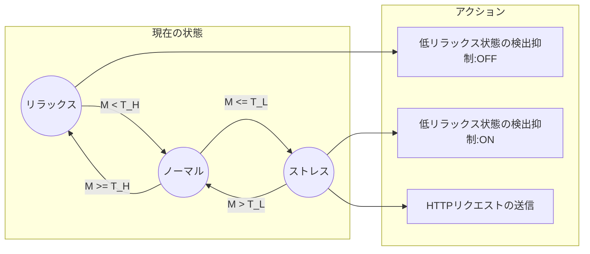

## はじめに

2022年11月15日(火)にHeart Rate Switch（心拍スイッチ）という名前でFitbitアプリをリリースしました。アプリについてはFitbit Galleryに登録されており、スマートフォンから下記のページにアクセスすることでインストール可能です。

https://gallery.fitbit.com/details/989e530e-c44d-448d-8afe-653f4c59a179

ソースコードについてもMITライセンスで公開しています。

https://github.com/tatsuyasusukida/heartrate-switch

この記事ではアプリの機能と実装のポイントについて紹介します。

、開発のきっかけ、着手からリリースまでの流れについて紹介します。


## アプリの機能

### このアプリは何か？

このアプリは心拍数データからリラックス傾向を評価し、ストレスが高い状態になった時にHTTPリクエストを送信するFitbitアプリです。このアプリを[IFTTT](https://ifttt.com/)のようなIoTサービスと組み合わせて使うことにより、例えばストレスが高い状態になった時にスマートスピーカーで音楽を再生することができます。

### リラックス傾向の評価

このアプリはリラックス傾向$M$を$N$個の心拍数データのサンプル$h_1, h_2, ..., h_n$から次の数式を使って評価しています。

$$M = \sqrt{c_x^2 + c_y^2}$$

ここで$c_x = t_1 + t_2 + ... + t_{N-1}, c_y = t_2 + t_3 + ... + t_N、t_n = 60 / h_n$です。

### 設定

このアプリのユーザーは次の5点を設定することができます。

- 心拍数データの保持期間[秒]
- 高リラックス状態の閾値｜$T_H$
- 低リラックス状態の閾値｜$T_L$
- 低リラックス状態検出時のHTTPリクエスト送信のON/OFF
- HTTPリクエストのURL


### 状態遷移

このアプリはリラックス状況$M$、高リラックス状態の閾値$T_H$、低リラックス状態の閾値$T_L$から現在の状態がリラックス、ノーマル、ストレスのいずれであるかを次の基準で判定します。

- もし$M \ge T_H$ならばリラックス
- もし$T_H \lt M \lt T_L$ならばノーマル
- もし$M \le T_L$ならばストレス

### HTTPリクエストの送信

現在の状態がノーマルからストレスに変わった時、アプリは低リラックス状態を検出してHTTPリクエストを送信します。HTTPリクエストの送信が短時間に何度も行われることを防ぐため、アプリは低リラックス状態を1回検出するとその後の検出を抑制します。現在の状態がノーマルからリラックスに変わった時、アプリは低リラックス検出の抑制を解除します。



### 画面

このアプリはデバイスの画面に次の7点を表示します。

- 現在のリラックス傾向
- 高リラックス状態の閾値
- 定リラックス状態の閾値
- 心拍数データの保持期間
- 低リラックス検出時のHTTPリクエスト送信のON/OFF
- ストレス状態の検出回数


### 対応デバイス

このアプリはFitbit Versa3とFitbit Senseでのみ動作します。


## 開発のきっかけ

新潟県内の療育施設や大学と連携して「応用行動分析カメラ」という発達障害のお子さん向けアプリを数年前から共同開発しています。撮影ボタンを押してから前後20秒／合計40秒の短い動画を撮影することに特化したカメラアプリで朝日新聞さんの記事でわかりやすく説明されています。

https://www.asahi.com/articles/ASN7M3HKPN74UOHB00J.html

現状では保護者や指導員がお子さんの動画を撮影したい時に手動でボタンを押していますが、ストレスが高い状態を検出した時に自動で撮影を開始してはどうかというアイデアをいただいたことが心拍スイッチFitbitアプリを開発したきっかけでした。


## 着手からリリースまでの流れ

過去にもIoT Buttonという名前でFitbitアプリをリリースした経験がありましたが、ボタンを押したらHTTPリクエストを送信するだけの極めてシンプルなアプリでした。開発期間も半日とごく短いものでした。

https://gallery.fitbit.com/details/5ce40571-a58d-4459-82e0-24fcf3fc52cb

闇雲に進めても途中で挫折する悲しい未来が見えたので下記の4つのステップからなる開発計画を作成しました。

1. 検証：2週間
2. プロトタイプ作成：1週間
3. 仕様策定：1週間
4. プロダクト作成：2週間

それぞれのステップについて下記の内容を明記しました。

- ステップの目標
- 期間
- 成果物

作成にあたっては簡単に入力や共有ができる[GitHub Gist](https://gist.github.com/)を使用しました。作成したGistについては下記の通りです。

https://gist.github.com/tatsuyasusukida/a6e0f76d575a310ddb26586e6433b402

開発計画を作成して各ステップの締切を設定したことでスケジュール通りに開発を進めることができました。


<!-- 
## 第1ステップ：検証

### 目標

このステップでは下記を検証することを目標としました。

- アプリを起動したままにする方法
- Fitbitの画面が非表示の状態で(1)心拍データの取得、(2)ファイルの読み書き、(3)HTTPリクエストの送信ができるかどうか

### 作成

検証のために下記の機能を備えた心拍ログ収集FitbitアプリとクラウドAPIを作成しました。

- 心拍センサーから心拍数を取得する
- 取得した心拍数を画面に表示する
- 取得した心拍数を取得日時と共にファイルに書き込む
- ファイルに書き込んだ心拍データを一定間隔（例: 1分）毎にクラウドAPIに送信する
- クラウドAPIでは受信した心拍データをストレージに保存する

クラウドAPIの作成にはNext.jsを使用しました。ホスティングとストレージにはそれぞれGCPのCloud RunとCloud Storageを利用しました。

### 実験

作成したFitbitアプリをインストールした実機を身に付けて一定時間(例: 1時間)経過後に下記2点を確認する実験を行いました。

- アプリが起動したままの状態にできること
- クラウドストレージにデータ（心拍数と取得日時）が保存されていること

実験でクラウドストレージに保存されたデータから下記の散布図を作成しました。横軸が取得日時、縦軸が心拍数です。


### 成果

このステップを通じて下記の成果を得ることができました。

- 心拍ログ収集FitbitアプリとクラウドAPIが完成した
- 1時間以上アプリを起動したままの状態にできることを検証できた
- クラウドストレージにデータ（心拍数と取得日時）が保存されていることを検証できた、ただし5〜10分程度の期間のデータに欠損が生じていた、原因は不明

ちなみにFitbitアプリを起動したままにする方法についてはFitbit公式ドキュメントの[Appbit API](https://dev.fitbit.com/build/reference/device-api/appbit/)のページに下記の記載がありました。コード例は下記の通りです。

```js
import { me as appbit } from "appbit";
appbit.appTimeoutEnabled = false;
```


## 第2ステップ：プロトタイプ作成

### 目標

このステップの目標は下記の開発目標の実現可能性を検証することを目標としました。

> 心拍情報からストレス傾向を分析して設定した閾値を上回った場合にリアルタイムでHTTPリクエストを送信するFitbitアプリを開発する。

### 作成

第1ステップ：検証で作成した心拍ログ収集Fitbitアプリの機能に加え、下記の機能を備えた心拍スイッチFitbitアプリ／クロックフェイスのプロトタイプとクラウドAPIを作成しました

- ファイルに書き込んだ心拍データからストレス傾向を算出する
- 算出したストレス傾向が一定の閾値を上回る場合にHTTPリクエストを送信する
- クラウドAPIではHTTPリクエストの受信記録をストレージに保存する

### 作成 -->
