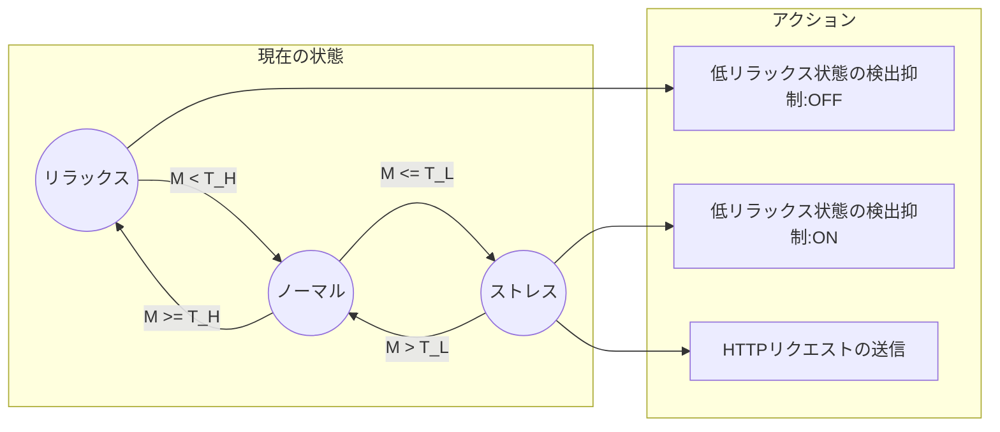

## はじめに

2022年11月15日(火)にHeart Rate Switch（心拍スイッチ）という名前でFitbitアプリをリリースしました。アプリについてはFitbit Galleryに登録されており、スマートフォンから下記のページにアクセスすることでインストール可能です。

https://gallery.fitbit.com/details/989e530e-c44d-448d-8afe-653f4c59a179

ソースコードについてもMITライセンスで公開しています。

https://github.com/tatsuyasusukida/heartrate-switch

この記事ではアプリの機能と実装のポイントについて紹介します。

## アプリの機能

### このアプリは何か？

このアプリは心拍数データからリラックス傾向を評価し、ストレスが高い状態になった時にHTTPリクエストを送信するFitbitアプリです。このアプリを[IFTTT](https://ifttt.com/)のようなIoTサービスと組み合わせて使うことにより、例えばストレスが高い状態になった時にスマートスピーカーで音楽を再生することができます。

### リラックス傾向の評価

このアプリはリラックス傾向$M$を$N$個の心拍数データのサンプル$h_1, h_2, ..., h_n$から次の数式を使って評価しています。

$$M = \sqrt{c_x^2 + c_y^2}$$

ここで$c_x = t_1 + t_2 + ... + t_{N-1}, c_y = t_2 + t_3 + ... + t_N、t_n = 60 / h_n$です。

### 設定

このアプリのユーザーは次の5点を設定することができます。

- 心拍数データの保持期間[秒]
- 高リラックス状態の閾値｜$T_H$
- 低リラックス状態の閾値｜$T_L$
- 低リラックス状態検出時のHTTPリクエスト送信のON/OFF
- HTTPリクエストのURL

### 状態遷移

このアプリはリラックス状況$M$、高リラックス状態の閾値$T_H$、低リラックス状態の閾値$T_L$から現在の状態がリラックス、ノーマル、ストレスのいずれであるかを次の基準で判定します。

- もし$M \ge T_H$ならばリラックス
- もし$T_H \lt M \lt T_L$ならばノーマル
- もし$M \le T_L$ならばストレス

### HTTPリクエストの送信

現在の状態がノーマルからストレスに変わった時、アプリは低リラックス状態を検出してHTTPリクエストを送信します。HTTPリクエストの送信が短時間に何度も行われることを防ぐため、アプリは低リラックス状態を1回検出するとその後の検出を抑制します。現在の状態がノーマルからリラックスに変わった時、アプリは低リラックス検出の抑制を解除します。

### 画面

このアプリはデバイスの画面に次の7点を表示します。

- 現在のリラックス傾向
- 高リラックス状態の閾値
- 定リラックス状態の閾値
- 心拍数データの保持期間
- 低リラックス検出時のHTTPリクエスト送信のON/OFF
- ストレス状態の検出回数

### 対応デバイス

このアプリはFitbit Versa3とFitbit Senseでのみ動作します。
