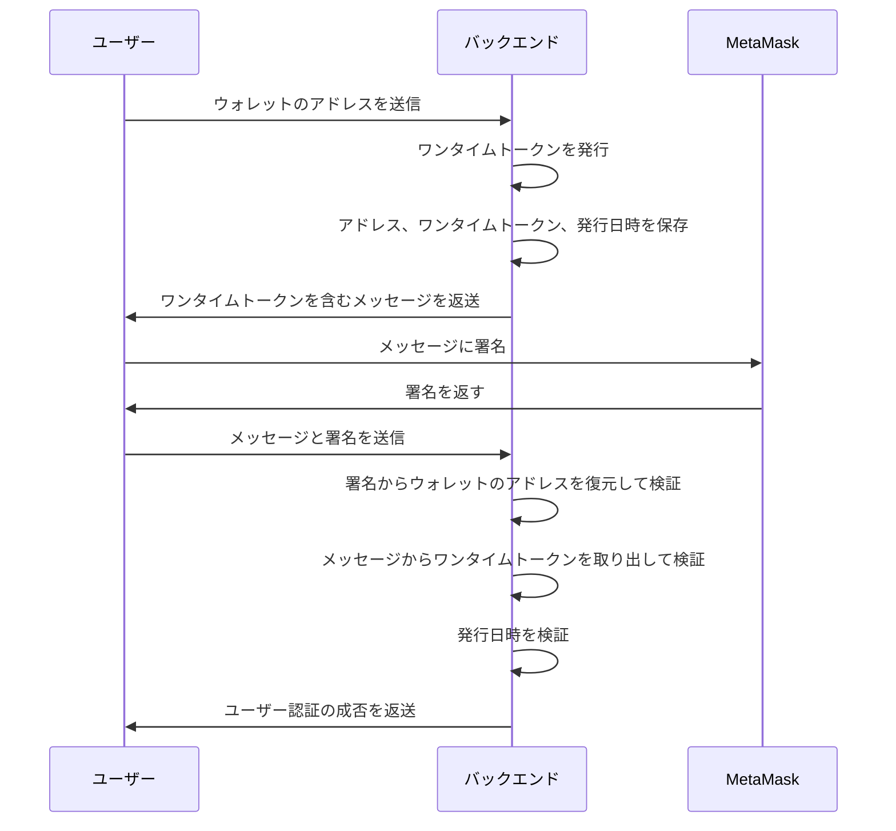

## この記事について

[Ethers.js](https://docs.ethers.io/)の署名と検証を利用して[OpenSea](https://opensea.io/)のようなユーザー認証を実装しようとしましたが初心者の私には難しくて途中で挫折してしまいました。まったくもって不完全ですが、この記事では現状の実装方法についてまとめようと思います。この記事の関連リソースを下記に示します。

- [ソースコード](https://github.com/tatsuyasusukida/web3login)

## やりたいこと

Ethers.jsの署名と検証を利用したユーザー認証を実装するにあたり、下記の記事を参考にしました。

- [DApps のユーザー認証に web3.eth.personal.sign を使おう！ - Tech Inside Drecom](https://tech.drecom.co.jp/dapps-use-web3-eth-personal-sign/)

上記の記事を参考にして設計したユーザーの認証シーケンスを下記に示します。




## コーディングの準備

ターミナルで下記のコマンドを実行してコーディングの準備をします。

```sh
npx create-next-app --typescript --use-npm web3login
cd web3login
npm install --save ethers iron-session
mkdir lib
touch lib/with-session.ts
touch pages/signin.tsx
touch pages/api/message.ts
touch pages/api/signin.ts
touch .env
```


## コーディング

エディタで下記のファイルを開いて内容を入力します。

### lib/with-session.ts

@[gist](https://gist.github.com/tatsuyasusukida/1293733300e689bd5556f4619626130f?file=with-session.ts)

### pages/signin.tsx

@[gist](https://gist.github.com/tatsuyasusukida/1293733300e689bd5556f4619626130f?file=signin.tsx)

### pages/api/message.ts

@[gist](https://gist.github.com/tatsuyasusukida/1293733300e689bd5556f4619626130f?file=message.ts)

### pages/api/signin.ts

@[gist](https://gist.github.com/tatsuyasusukida/1293733300e689bd5556f4619626130f?file=signin.ts)

### .env

@[gist](https://gist.github.com/tatsuyasusukida/1293733300e689bd5556f4619626130f?file=.env)


## 動作確認

下記のコマンドを実行してサーバーを起動します。

```sh
npm run dev
```

ブラウザで http://localhost:3000/signin にアクセスします。
Signinボタンをクリックします。
MetaMaskの署名の要求が表示されたら署名ボタンをクリックします。
Sign in completedとメッセージが表示されることを確認します。

### 参考画像

#### アクセス直後


#### Signinボタン押下直後


#### 署名ボタン押下直後


## おわりに

この記事で紹介した方法は下記の点で不完全です。

- ユーザーがページをリロードした時のことが考慮されていない
- ユーザーがMetaMaskを操作して接続解除した時のことが考慮されていない
- ユーザーがMetaMaskを操作して別のアカウントに切り替えた時のことが考慮されていない

Alchemy公式ドキュメントの[Integrating Your Smart Contract with the Frontend](https://docs.alchemy.com/docs/integrating-your-smart-contract-with-the-frontend)によると、リロードについては下記のように取扱いが可能です。

```ts
useEffect(() => {
  const provider = new ethers.providers.Web3Provider(window.ethereum)
  const [address] = provider.send('eth_accounts', [])
  console.log({address})
}, [])
```

また、MetaMask操作による接続解除や別アカウントへの切り替えについては下記のように取扱いが可能です。

```ts
useEffect(() => {
  const onAccountsChanged = ([address]) => {
    console.log({address})
  }

  window.ethereum.on('accountsChanged', onAccountsChanged)

  return () => {
    window.ethereum.removeListener('accountsChanged', onAccountsChanged)
  }
}, [])
```

リロードなどのイベントを取扱う方法はわかったのですが、各種イベントが発生した時にどのように動作するべきかのベストプラクティスについては何が正解かがわかりませんでした。自己流の方法を考案して実装することも不可能ではないですがセキュリティホールを作ってしまう恐れがあるので可能な限り自己流は避けてベストプラクティスに従いたい所です。

そんなことを色々と考えているうちに面倒になって挫折してしまいました(笑)

通常のユーザー認証であれば[Auth0](https://auth0.com/)などの確立されたIDaaSを利用することができます。Web3でのユーザー認証についても[web3auth](https://web3auth.io/)などがあり、少し触ってみただけでしくみは全然理解できていないですが有望な感じがしました。このようなサービスが増えることを期待します。

何か参考になる情報をご存じの方がいましたらご指導のコメントをいただければ幸いです。
