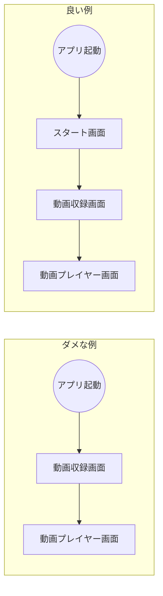

## この記事について

この記事ではFlutterの[Camera](https://pub.dev/packages/camera)プラグインを使ってiOSアプリで動画を収録する時にiOS実機で発生した下記の現象を回避する方法について紹介します。

- 収録を繰り返すと音声が入らなくなる
- 収録を繰り返すと最初の方に黒い画面が入る

上記の現状の再現手順については下記の記事で紹介しています。

[Flutterで動画を収録する方法](https://zenn.dev/tatsuyasusukida/articles/how-to-record-video-in-flutter)

結論としてはアプリ起動時にいきなり動画収録画面を表示するのではなく、まずはスタート画面を表示してから動画収録画面に移動することで、現象が回避できることがわかりました。



以下、手順について説明します。


## コーディングの準備

VSCodeをお使いの場合はFlutter: New Projectコマンドを実行してプロジェクトを作成します。

プロジェクトが作成されたらターミナルで下記のコマンドを実行します。

```sh
flutter pub add camera path_provider path video_player
flutter pub get
touch lib/start_screen.dart
touch lib/video_recorder_screen.dart
touch lib/video_player_screen.dart
```

ios/Runner.xcodeprojを開いて3カ所あるPRODUCT_BUNDLE_IDENTIFIERを修正します。

```
PRODUCT_BUNDLE_IDENTIFIER = com.loremipsum.VideoRecorder(日付8桁);
```

ios/Runner/Info.plistを開いて下記の内容を追加します。

```
<key>NSCameraUsageDescription</key>
<string>your usage description here</string>
<key>NSMicrophoneUsageDescription</key>
<string>your usage description here</string>
```


## コーディング

### main.dart

@[gist](https://gist.github.com/tatsuyasusukida/a7915c0ab44fcee5aa2e9785331a5876?file=main.dart)

### start_screen.dart

@[gist](https://gist.github.com/tatsuyasusukida/a7915c0ab44fcee5aa2e9785331a5876?file=start_screen.dart)

### video_recorder_screen.dart

@[gist](https://gist.github.com/tatsuyasusukida/a7915c0ab44fcee5aa2e9785331a5876?file=video_recorder_screen.dart)

### video_player_screen.dart

@[gist](https://gist.github.com/tatsuyasusukida/a7915c0ab44fcee5aa2e9785331a5876?file=video_player_screen.dart)


## 動作確認

VSCodeのステータスバーのDevice SelectorエリアでiOS実機を選択します。

メニューからRun > Start Debuggingを選んでクリックしてデバッグを開始します。

iOS実機でアプリが起動してStart screenが表示されたらCameraボタンをクリックします。

Video recorder screenが表示されたら、フローティングアクションボタンを2回タップしてフロントカメラから動画を収録します。

動画の収録が完了してVideo player screenが表示されたら、フローティングアクションボタンをアップして収録した動画を再生します。

何度か収録と再生を繰り返し、下記の現象が発生しないことを確認します。

- 収録を繰り返すと音声が入らなくなる
- 収録を繰り返すと最初の方に黒い画面が入る


## おわりに

検証前は「動画を1回収録した後はスタート画面に戻らないと現象を回避できないだろうな」と思っていましたが、スタート画面に戻らなくても回避できたので驚きました。もしかしてアプリの起動直後にカメラを使おうとしているのがダメなのでしょうか？原因については不明のままです。

現象を回避できたこと自体は良かったのですが原因がわからないのは怖いので、万全を期すのであればSwiftUIを使って開発した方がベターだと思いました。