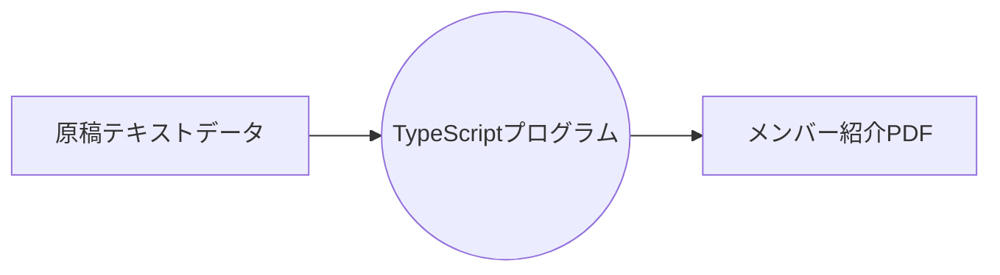

## この記事について

つい先日、とある団体のメンバー紹介リストを作成する仕事を頼まれました。普通にWordを使っても良かったのですがHTMLとCSSを使った方が楽しそうだったのでTypeScriptでHTMLを生成するプログラムを作成しました。この記事ではメンバー紹介リストを作成する一連の手順を紹介します。


## やりたいこと

原稿をテキストデータとして入力すると、メンバー紹介リストがPDFとして出力されるTypeScriptのプログラムを作成します。



出力されるメンバー紹介リストの例を下記に示します。


## コーディングの準備

ターミナルで下記のコマンドを実行してコーディングの準備をします。

```sh
mkdir member-list
cd member-list
npm init -y
npm install --save mustache
npm install --save-dev @types/mustache @types/node ts-node
mkdir img
touch input.txt main.ts template.html style.css
```


## コーディング

エディタで下記のファイルを開いて内容を入力します。

### input.txt

@[gist](https://gist.github.com/tatsuyasusukida/29187a0ebaa753896e67fab34bdca540?file=input.txt)

入力データの形式についてはJSONやYAMLなどにしても良かったのですが、手作業でフォーマットを整えるのが面倒だったので下記のオリジナル形式を作成しました。

1. 氏名
1. フリガナ
1. 所属
1. 写真
1. (空行)
1. 自己紹介(複数行)
1. (空行)
1. リストの見出し
1. リストの項目(複数行)
1. (空行×3)

### main.ts

@[gist](https://gist.github.com/tatsuyasusukida/29187a0ebaa753896e67fab34bdca540?file=main.ts)

### template.html

@[gist](https://gist.github.com/tatsuyasusukida/29187a0ebaa753896e67fab34bdca540?file=template.html)

### style.css

style.cssについてはやや長いので割愛しますが下記のリンクから閲覧可能です。

https://gist.github.com/tatsuyasusukida/29187a0ebaa753896e67fab34bdca540#file-style-css


## メンバーリストの生成

ターミナルで下記のコマンドを実行してメンバーリストを生成します。

```sh
npx ts-node main.ts
```

成功すると`output.html`が作成されるのでブラウザで開いて内容を確認します。


## おわりに

この記事で紹介したTypeScript + HTML + CSSを使う方法以外にも様々な方法でメンバー紹介リストを作成することができます。一例を下記に示します。

- 手書き
- イラレを使う
- Wordを使う
- HTML + CSSだけを使う

手書きとイラレについては私にはスキルがないのでできないですが、もしできたら素晴らしいものができるのだと思います、時間はかかるでしょうが...

Wordはとっかかりは早いのが良いです。一方、書式を設定や写真の幅調整などのスタイリングを手作業で一つ一つしなければならないので面倒です。

HTML + CSSだけを使うのもTypeScriptのコーディングの手間が減って良いです。CSSを使ってスタイリングできるのも楽です。一方、HTMLの構造が変わったりした時に手作業で一つ一つ修正しなければならないので面倒です。

TypeScript + HTML + CSSを使うとコーディング量は増えるので出来上がるまでに時間がかかります。出来上がってからの調整は楽です。どの方法が良いかはケースバイケースです。

入力データにJSONやYAMLを使った方がTypeScriptのコーディング量は減りますがエンジニア以外の方が編集するのが難しくなります。入力作業を手伝ってもらいたい場合は下記のようなオリジナルのテキスト形式を考えてWordなどで入力してもらうと良いかも知れません。

```
氏名：【ここに氏名を入力してください】
フリガナ：【ここにフリガナを入力してください】
所属：【ここに所属を入力してください】
```
