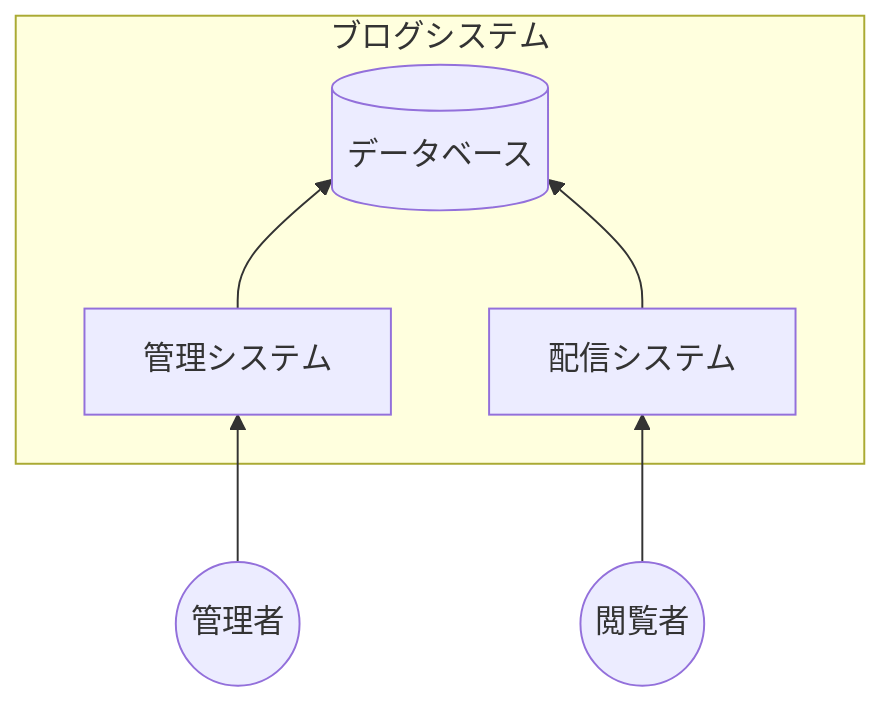
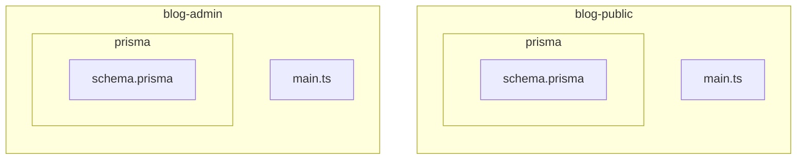
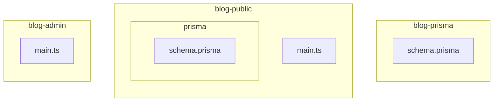
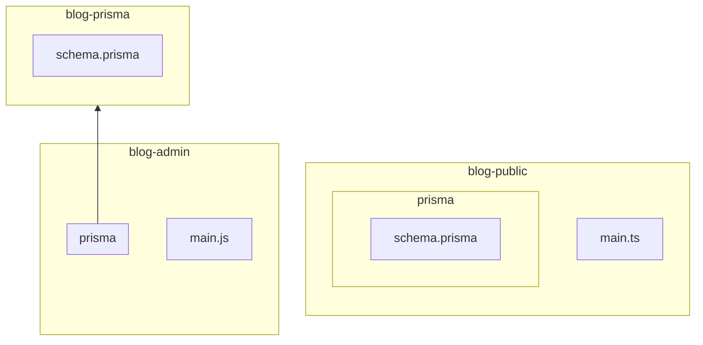
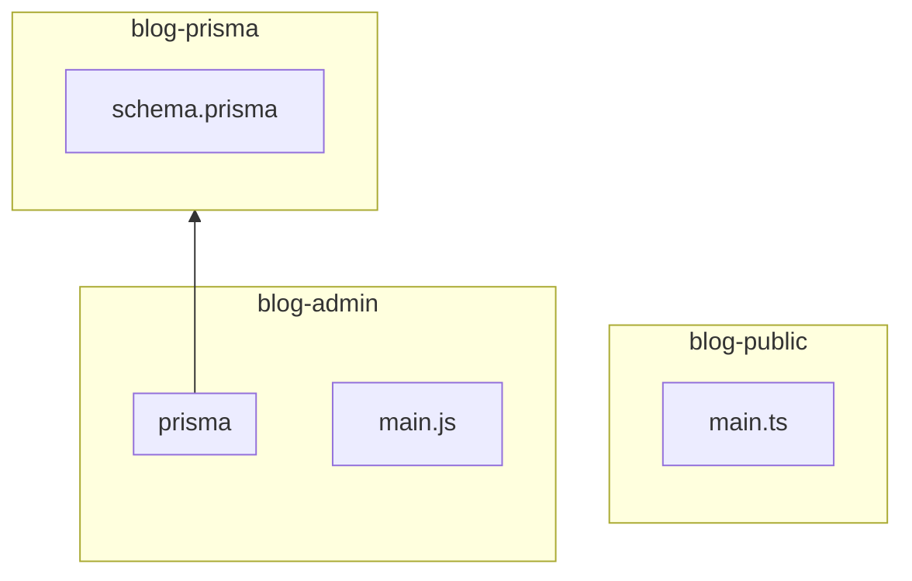
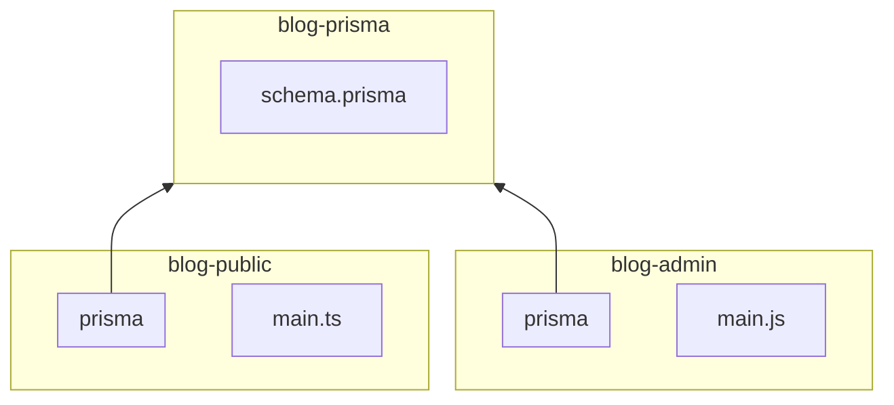

## この記事について

この記事ではGitの[サブモジュール機能](https://git-scm.com/book/ja/v2/Git-%E3%81%AE%E3%81%95%E3%81%BE%E3%81%96%E3%81%BE%E3%81%AA%E3%83%84%E3%83%BC%E3%83%AB-%E3%82%B5%E3%83%96%E3%83%A2%E3%82%B8%E3%83%A5%E3%83%BC%E3%83%AB)を使ってPrismaスキーマを複数のプロジェクトで共有する方法について紹介します。

この方法が役に立つのは、例えばTypeScriptでブログシステムを開発していて管理システムと配信システムを別々に作っているけどデータベースは共通している、といった場面です。



このような場面ではPrismaスキーマが管理システムと配信システムの両方のコードベースに必要となります。

普通にコピー＆ペーストしても悪くはないかと思いますが、より良い方法としてGitのサブモジュール機能を使った方法を紹介します。


## 前の記事について

この記事は前に投稿した[Git Submoduleを使って共通のソースコードを複数のプロジェクトで共有する方法](https://zenn.dev/tatsuyasusukida/articles/how-to-share-source-code-using-git-submodule-basic)の応用編です。内容についてはNode.jsのソースコードがPrismaスキーマに変わっただけでやっていることは全く一緒です。前の記事の方が例がシンプルでわかりやすいのでこの記事の説明がわかりにくい場合は前の記事を参照してもらえれば幸いです。


## 共有する前の状態

ブログの管理システム（blog-admin）と配信システム（blog-public）でPrismaスキーマを共有したい状況を仮定します。ターミナルで下記のコマンドを実行してPrismaスキーマを共有する前の状態を再現します。

```sh
mkdir blog-admin
cd blog-admin
npm init -y
npm install --save-dev prisma typescript ts-node @types/node
touch main.ts
npx prisma init --datasource-provider sqlite

cd ..

mkdir blog-public
cd blog-public
npm init -y
npm install --save-dev prisma typescript ts-node @types/node
touch main.ts
npx prisma init --datasource-provider sqlite
```

上記のコマンドを実行した後のファイル構成はblog-adminとblog-publicで同一です。

- blog-adminまたはblog-public
  - node_modules
  - prisma
    - schema.prisma
  - .env
  - .gitignore
  - main.ts
  - package-lock.json
  - package.json

prisma/schema.prismaと.envの内容については下記の通りとします。blog-adminとblog-publicで同一です。

```:prisma/schema.prisma
generator client {
  provider = "prisma-client-js"
}

datasource db {
  provider = "sqlite"
  url      = env("DATABASE_URL")
}

model Post {
  id        Int     @id @default(autoincrement())
  title     String
  content   String?
  published Boolean @default(false)
}
```

```:.env
DATABASE_URL="file:/tmp/blog.db"
```

ターミナルで下記のコマンドを実行してデータベース作成とPrismaクライアント生成を行います。Prismaクライアント生成がblog-adminとblog-publicの両方で必要になるので`npx prisma migrate dev --name init`を2回実行しています。blog-publicの方では`npx prisma generate`でも大丈夫かも知れません。

```sh
cd ../blog-admin
npx prisma migrate dev --name init

cd ../blog-public
npx prisma migrate dev --name init
```

main.tsの内容については下記の通りとします。blog-adminとblog-publicで異なります。

```ts:blog-admin/main.ts
import { PrismaClient } from '@prisma/client'

const prisma = new PrismaClient()

async function main() {
  const post = await prisma.post.create({
    data: {
      title: 'ここにタイトルが入ります',
      content: 'ここに内容が入ります。ここに内容が入ります。',
      published: true,
    },
  })

  console.log(post)
}

main()
  .then(async () => {
    await prisma.$disconnect()
  })
  .catch(async (e) => {
    console.error(e)
    await prisma.$disconnect()
    process.exit(1)
  })
```

```ts:blog-public/main.ts
import { PrismaClient } from '@prisma/client'

const prisma = new PrismaClient()

async function main() {
  const posts = await prisma.post.findMany({
    where: {
      published: true,
    },
    orderBy: {
      id: 'asc',
    },
  })

  for (const post of posts) {
    console.log(`<a href="/posts/${post.id}">${post.title}</a>`)
  }
}

main()
  .then(async () => {
    await prisma.$disconnect()
  })
  .catch(async (e) => {
    console.error(e)
    await prisma.$disconnect()
    process.exit(1)
  })
```

blog-admin/main.tsを3回くらい実行してデータベースにレコードを挿入します。

```sh
cd ../blog-admin/main.ts
npx ts-node main.ts
npx ts-node main.ts
npx ts-node main.ts
```

実行結果を下記に示します。

```
{
  id: 1,
  title: 'ここにタイトルが入ります',
  content: 'ここに内容が入ります。ここに内容が入ります。',
  published: true
}
```

blog-public/main.tsを実行してデータベースにレコードが挿入されたことを確認します。

```sh
cd ../blog-public/main.ts
npx ts-node main.ts
```

実行結果を下記に示します。

```
<a href="/posts/1">ここにタイトルが入ります</a>
<a href="/posts/2">ここにタイトルが入ります</a>
<a href="/posts/3">ここにタイトルが入ります</a>
```

この時点の状態を図示すると下記のようになります。schema.prismaとmain.ts以外のファイルについては割愛しています。



最後にGitの初期化を行います。

```sh
cd ../blog-admin
git init
git add .
git commit -m "Initial commit"

cd ../blog-public
git init
git add .
git commit -m "Initial commit"
```

この状態から下記の3ステップを経てprismaディレクトリを共有します。

1. 共有レポジトリの作成
2. サブモジュールの作成
3. サブモジュールの共有


## ステップ1：共有レポジトリの作成

下記のコマンドを実行してblog-adminからprismaディレクトリを削除（移動）します。

```sh
cd ../blog-admin
mv prisma ../blog-prisma
git add .
git commit -m "Remove prisma directory"
```

下記のコマンドを実行して共有するソースコード用のレポジトリ（以下「共有レポジトリ」と呼びます）を作成します。

```sh
cd ../blog-prisma
git init
git add .
git commit -m "Initial commit"
```

下記のコマンドを実行して共有レポジトリをGitHubにプッシュします。

```sh
gh repo create blog-prisma --private
git remote add origin git@github.com:tatsuyasusukida/blog-prisma
git push origin main
```

この時点の状態を図示すると下記のようになります。



この時点ではblog-adminにprisma/schema.prismaが存在しないので`npx prisma generate`を実行できません。

```
$ npx prisma generate
Environment variables loaded from .env
prisma:warn The postinstall script automatically ran `prisma generate` and did not find your `prisma/schema.prisma`.
If you have a Prisma schema file in a custom path, you will need to run
`prisma generate --schema=./path/to/your/schema.prisma` to generate Prisma Client.
If you do not have a Prisma schema file yet, you can ignore this message.
```


## ステップ2：サブモジュールの作成

下記のコマンドを実行してblog-adminにサブモジュールを作成します。

```sh
cd ../blog-admin
git submodule add \
  git@github.com:tatsuyasusukida/blog-prisma \
  prisma
git add .
git commit -m "Add prisma submodule"
```

この時点の状態を図示すると下記のようになります。



この時点ではblog-adminにprisma/schema.prismaが存在するので`npx prisma generate`を実行できます。

```
$ npx prisma generate
Environment variables loaded from .env
Prisma schema loaded from prisma/schema.prisma

✔ Generated Prisma Client (4.5.0 | library) to ./node_modules/@prisma/client in 41ms
You can now start using Prisma Client in your code. Reference: https://pris.ly/d/client

import { PrismaClient } from '@prisma/client'
const prisma = new PrismaClient()
```


## ステップ3：サブモジュールの共有

下記のコマンドを実行してblog-publicからprismaディレクトリを削除します。

```sh
cd blog-public
rm -rf prisma
git add .
git commit -m "Remove prisma directory"
```

この時点の状態を図示すると下記のようになります。



この時点ではblog-publicにprisma/schema.prismaが存在しないので`npx prisma generate`を実行できません。

```
$ npx prisma generate
Environment variables loaded from .env
prisma:warn The postinstall script automatically ran `prisma generate` and did not find your `prisma/schema.prisma`.
If you have a Prisma schema file in a custom path, you will need to run
`prisma generate --schema=./path/to/your/schema.prisma` to generate Prisma Client.
If you do not have a Prisma schema file yet, you can ignore this message.
```

続いて下記のコマンドを実行してサブモジュールを作成します。

```sh
git submodule add \
  git@github.com:tatsuyasusukida/blog-prisma \
  prisma
git add .
git commit -m "Add prisma submodule"
```

この時点の状態を図示すると下記のようになります。



この時点ではblog-publicにprisma/schema.prismaが存在するので`npx prisma generate`を実行できます。

```
$ npx prisma generate
Environment variables loaded from .env
Prisma schema loaded from prisma/schema.prisma

✔ Generated Prisma Client (4.5.0 | library) to ./node_modules/@prisma/client in 41ms
You can now start using Prisma Client in your code. Reference: https://pris.ly/d/client

import { PrismaClient } from '@prisma/client'
const prisma = new PrismaClient()
```


## 共有モジュールに変更が生じた場合

blog-admin/prisma/schema.prismaのPostモデルに`date`フィールドを追加したとします。

```:blog-admin/prisma/schema.prisma
model Post {
  id        Int      @id @default(autoincrement())
  title     String
  content   String?
  published Boolean  @default(false)
  date      DateTime? // このフィールドを追加しました
}
```

ターミナルで下記のコマンドを実行してマイグレーションを行います。

```
cd ../blog-admin
npx prisma migrate --name added_date
```

サブモジュールを変更した場合はblog-admin**ではなく**blog-admin/prismaで変更をコミットしてプッシュします。

```sh
cd prisma
git add .
git commit -m "Add date field"
git push
```

続いてblog-adminでサブモジュールの変更をコミットします。

```sh
cd ..
git add .
git commit -m "Update prisma submodule"
```

以上でblog-adminの方の作業は終わりです。引き続きblog-publicの方で作業を行います。

blog-public**ではなく**blog-public/prismaで変更をプルします。

```sh
cd ../blog-public/prisma
git pull
```

続いてblog-publicでサブモジュールの変更をコミットします。

```sh
cd ..
git add .
git commit -m "Update prisma submodule"
```

下記のコマンドを実行してblog-publicにblog-adminでの変更が反映されたことを確認します。

```
$ cat prisma/schema.prisma
generator client {
  provider = "prisma-client-js"
}

datasource db {
  provider = "sqlite"
  url      = env("DATABASE_URL")
}

model Post {
  id        Int       @id @default(autoincrement())
  title     String
  content   String?
  published Boolean   @default(false)
  date      DateTime? // このフィールドを追加しました
}
```


## おわりに

「Prisma スキーマ 共有」で検索するとtakky94さんが投稿した[モノレポにおけるback/front間のPrismaの型共有の方法](https://zenn.dev/takky94/articles/23f4c814432208)というタイトルのZenn記事がヒットします。

takky94さんの記事ではモノレポ（1つのGitレポジトリに複数のプロジェクトが含まれている状態）の場合にPrismaによって自動生成されるTypeScriptの型をバックエンドとフロントエンドで共有する方法がまとめられていて勉強になります。ちなみに私の記事で紹介している方法はモノレポではなくプロジェクトごとにGitレポジトリを分けている状態を想定しており、前提が異なるので方法も異なっています。

takky94さんの記事ではaiji42さんが下記のコメントを投稿していてこちらもとても勉強になります。

> 個人的には、databaseという名でワークスペースを追加し、そこから@prisma/clientをエクスポートして、backend/frontendからは依存パッケージとしてインポートするという方法を取っています。そうすることで、`@prisma/client`のバージョンもバックとフロントでかんたんに揃えられてよいかと。

上記の方法を採用する場合の例として下記のレポジトリが紹介されています。

https://github.com/vercel/turbo/tree/main/examples/with-prisma

モノレポの場合は下記のような構成が良さそうです。

- apps
  - blog-admin
  - blog-public
- packages
  - database

turbo/examples/with-prismaのソースコードを読んでいて初めてnpmの[ワークスペース機能](https://docs.npmjs.com/cli/v8/using-npm/workspaces)について初めて知りました。モノレポの場合はワークスペース機能を使って共有すると楽なのですね。まだまだ知らないことだらけなので勉強に励みたいと思います。
