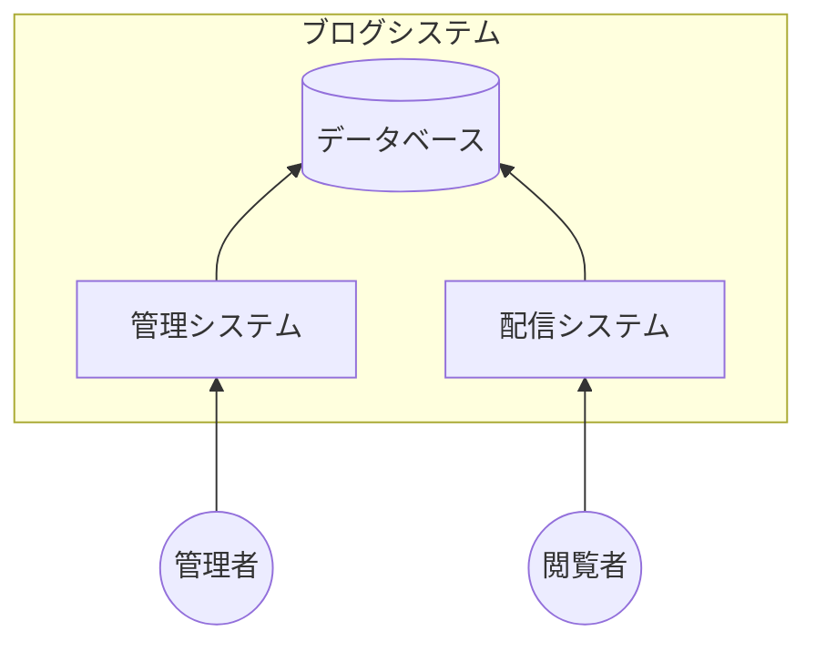
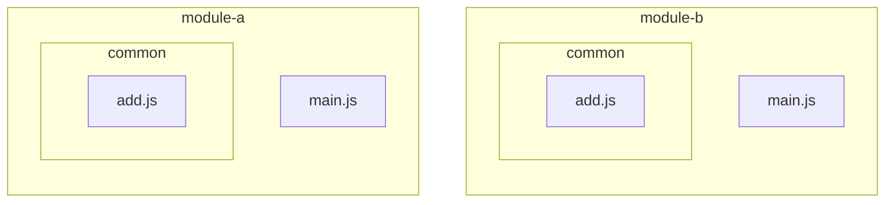
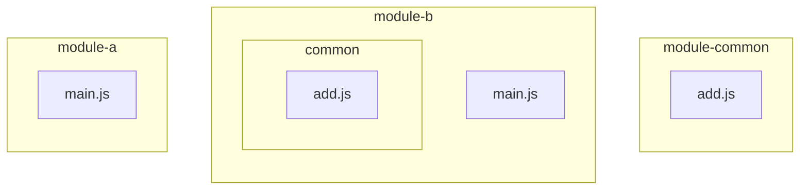
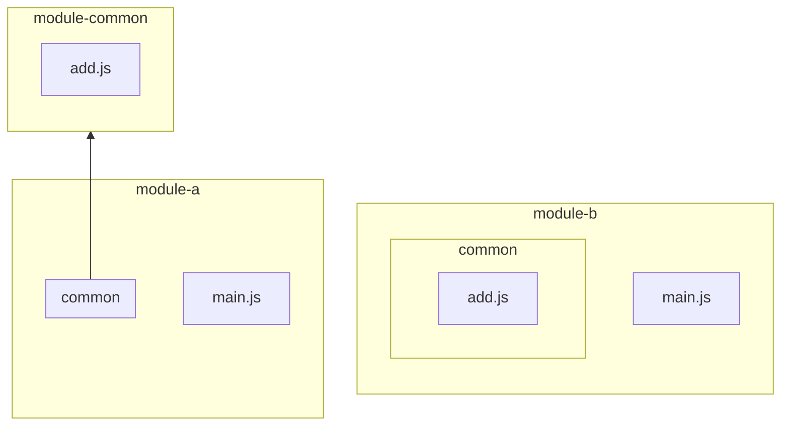
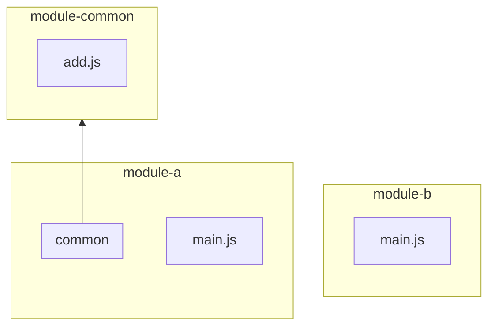
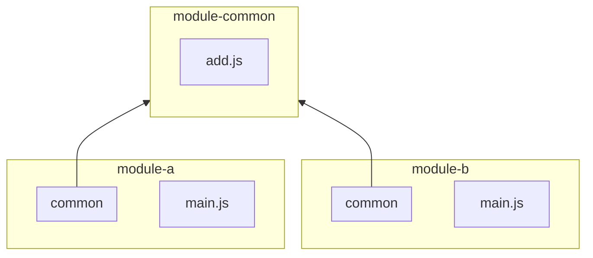
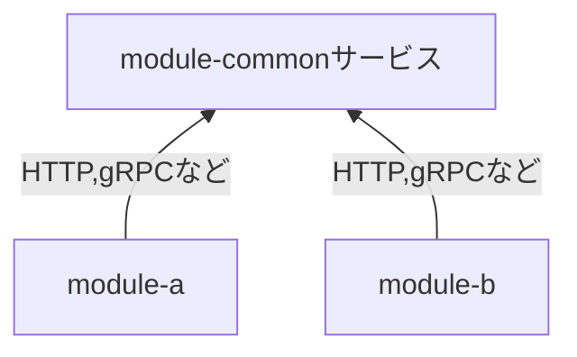

## この記事について

この記事ではGitの[サブモジュール機能](https://git-scm.com/book/ja/v2/Git-%E3%81%AE%E3%81%95%E3%81%BE%E3%81%96%E3%81%BE%E3%81%AA%E3%83%84%E3%83%BC%E3%83%AB-%E3%82%B5%E3%83%96%E3%83%A2%E3%82%B8%E3%83%A5%E3%83%BC%E3%83%AB)を使って共通のソースコードを複数のプロジェクトで共有する方法について紹介します。

この方法が役に立つのは、例えばNode.jsでブログシステムを開発していて管理システムと配信システムを別々に作っているけどデータベースは共通している、といった場面です。



このような場面ではPrismaやSequelizeのモデル定義が管理システムと配信システムの両方のコードベースに必要となります。

普通にコピー＆ペーストしても悪くはないかと思いますが、より良い方法としてGitのサブモジュール機能を使った方法を紹介します。


## 共有する前の状態

ソースコードを共有する前のファイル構成（再現コマンドを兼ねます）を下記と仮定します。

```sh
mkdir module-a
mkdir module-a/common
touch module-a/common/add.js
touch module-a/main.js

mkdir module-b
mkdir module-b/common
touch module-b/common/add.js
touch module-b/main.js
```

ソースコードの内容は下記の通りとします。

```js:add.js
function add(a, b) {
  return a + b
}

module.exports = add
```

```js:module-a/main.js
const add = require('./common/add')

function main() {
  const a = 1
  const b = 2
  const sum = add(a, b)

  console.log(`${a} + ${b} = ${sum}`)
}

main()
```

```js:module-a/main.js
const add = require('./common/add')

function main() {
  const a = 3
  const b = 4
  const sum = add(a, b)

  console.log(`${a} + ${b} = ${sum}`)
}

main()
```

Gitの初期化は済んでいるものとします。

```sh
cd module-a
git init
git add .
git commit -m "Initial commit"

cd ../module-b
git init
git add .
git commit -m "Initial commit"
```

図示すると下記のようになります。



この状態から下記の3ステップを経てcommonディレクトリを共有します。

1. 共有レポジトリの作成
2. サブモジュールの作成
3. サブモジュールの共有


## ステップ1：共有レポジトリの作成

下記のコマンドを実行してmodule-aからcommonディレクトリを削除（移動）します。

```sh
cd ../module-a
mv common ../module-common
git add .
git commit -m "Remove common directory"
```

下記のコマンドを実行して共有するソースコード用のレポジトリ（以下「共有レポジトリ」と呼びます）を作成します。

```sh
cd ../module-common
git init
git add .
git commit -m "Initial commit"
```

下記のコマンドを実行して共有レポジトリをGitHubにプッシュします。

```sh
gh repo create module-common --public
git remote add origin git@github.com:tatsuyasusukida/module-common
git push origin main
```

この時点の状態を図示すると下記のようになります。



この時点ではadd.jsが存在しないのでmodule-a/main.jsを実行できません。

```
$ node main.js
Error: Cannot find module './common/add'
```


## ステップ2：サブモジュールの作成

下記のコマンドを実行してmodule-aにサブモジュールを作成します。

```sh
cd module-a
git submodule add \
  git@github.com:tatsuyasusukida/module-common \
  common
git add .
git commit -m "Add common submodule"
```

この時点の状態を図示すると下記のようになります。



この時点ではadd.jsが存在するのでmodule-a/main.jsを実行できます。

```
$ node main.js
1 + 2 = 3
```


## ステップ3：サブモジュールの共有

下記のコマンドを実行してmodule-bからcommonディレクトリを削除します。

```sh
cd module-b
rm -rf common
git add .
git commit -m "Remove common directory"
```

この時点の状態を図示すると下記のようになります。



この時点ではadd.jsが存在しないのでmodule-b/main.jsを実行できません。

```
$ node main.js
Error: Cannot find module './common/add'
```

続いて下記のコマンドを実行してサブモジュールを作成します。

```sh
git submodule add \
  git@github.com:tatsuyasusukida/module-common \
  common
git add .
git commit -m "Add common submodule"
```

この時点の状態を図示すると下記のようになります。



この時点ではadd.jsが存在するのでmodule-b/main.jsを実行できます。

```
$ node main.js
1 + 2 = 3
```


## 共有モジュールに変更が生じた場合

module-a/common/add.jsに`console.log`でログを出力するコードを追加したとします。

```js:module-a/common/add.js
function add(a, b) {
  console.log(`a = ${a}, b = ${b}`) // このコードを追加しました
  return a + b
}

module.exports = add
```

module-a/main.jsの実行結果を下記に示します。

```
$ node main.js
a = 1, b = 2
1 + 2 = 3
```

サブモジュールを変更した場合はmodule-a**ではなく**module-a/commonで変更をコミットしてプッシュします。

```sh
cd ../module-a/common
git add .
git commit -m "Add console.log line"
git push
```

続いてmodule-aでサブモジュールの変更をコミットします。

```sh
cd ..
git add .
git commit -m "Update common submodule"
```

以上でmodule-aの方の作業は終わりです。引き続きmodule-bの方で作業を行います。

module-b**ではなく**module-b/commonで変更をプルします。

```sh
cd ../module-b/common
git pull
```

続いてmodule-bでサブモジュールの変更をコミットします。

```sh
cd ..
git add .
git commit -m "Update common submodule"
```

module-aでの変更が反映されたのでmodule-b/main.jsの実行結果は下記のようになります。

```
$ node main.js
a = 3, b = 4
3 + 4 = 7
```

## おわりに

ソースコードを共有する他の方法としては下記のように共通のソースコードをスタンドアローンで動作可能なサービスにまとめる方法が考えられます。



module-commonサービスのソースコードは下記のような感じになります。

```js:module-common/main.js
const express = require('express')
const app = express()

app.get('/add', (req, res) => {
  const a = parseInt(req.query.a, 10)
  const b = parseInt(req.query.b, 10)
  const sum = a + b

  res.send({ sum })
})

app.listen(3001)
```

module-aやmodule-bのmain.jsは下記のような感じになります。

```js:main.js
const fetch = require('node-fetch')

async function main() {
  const a = 1
  const b = 2
  const url = `http://localhost:3001/add?a=${a}&b=${b}`
  const response = await fetch(url)
  const { sum } = await response.json()

  console.log(`${a} + ${b} = ${sum}`)
}

main()
  .catch(err => console.error(err))
```

どちらが良いかはケースバイケースで例えばHTMLをPDFに変換する処理などはサービスにまとめた方が適しているかと思います。ちなみにHTMLをPDFに変換する方法については下記の記事で紹介していますので興味がありましたら読んでもらえると嬉しいです。

[PuppeteerでHTML→PDF変換 on Cloud Run](https://zenn.dev/tatsuyasusukida/articles/puppeteer-html2pdf)

この記事で扱った例はシンプルなものだったのであまり実践的ではありませんでしたが、近いうちにもっと現実的な例を扱った記事を投稿できるように頑張りたいと思います。
