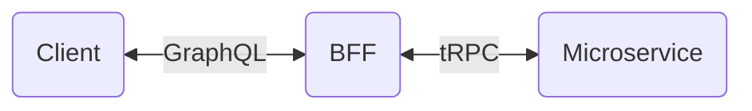

## この記事について

この記事ではNext.jsで[tRPC](https://trpc.io/)を使ってAPIを型安全にする方法について紹介します。記事の内容はtRPC公式ドキュメントの[Usage with Next.js](https://trpc.io/docs/v10/nextjs)に基づいていますが、簡略化するために推奨ディレクトリ構造（[Recommended file structure](https://trpc.io/docs/v10/nextjs#recommended-file-structure)）など一部の手順を省略しています。

使用するtRPCのバージョンはv10です。v10はこの記事を投稿する2022年9月23日時点ではbetaなのでAPIが変更される可能性があるのでご留意ください。


## コーディングの準備

ターミナルで下記のコマンドを実行してコーディングの準備をします。

```shell
npx create-next-app --typescript next-trpc
cd next-trpc
npm install --save
  @trpc/server@next \
  @trpc/client@next \
  @trpc/react@next \
  @trpc/next@next \
  @tanstack/react-query \
  zod
touch pages/client.tsx
mkdir pages/api/trpc
touch pages/api/trpc/[trpc].ts
mkdir utils
touch utils/trpc.ts
```


## コーディング

エディタで下記のファイルを開いて内容を入力します。

### pages/api/trpc/[trpc].ts

@[gist](https://gist.github.com/tatsuyasusukida/5e527a86e7131b4f34f48ac1430ba882?file=[trpc].ts)

### utils/trpc.ts

@[gist](https://gist.github.com/tatsuyasusukida/5e527a86e7131b4f34f48ac1430ba882?file=trpc.ts)

### pages/_app.tsx

@[gist](https://gist.github.com/tatsuyasusukida/5e527a86e7131b4f34f48ac1430ba882?file=_app.tsx)

### pages/client.tsx

@[gist](https://gist.github.com/tatsuyasusukida/5e527a86e7131b4f34f48ac1430ba882?file=client.tsx)


## 動作確認

ターミナルで下記のコマンドを実行してサーバーを起動します。

```shell
npm run dev
```

ブラウザで http://localhost:3000/ にアクセスして下記の内容が表示されることを確認します。

```
Hello tRPC
```


## 参考にしたWebページ

tRPCの先人たちの記事へのリンクを自分の備忘も兼ねて下記に示します。

https://zenn.dev/is_ryo/articles/08a9710d9f6ee2c

https://zenn.dev/terrierscript/articles/2022-08-20-trpc-utils

https://zenn.dev/terrierscript/articles/2022-08-18-trpc-nextjs-without-hoc


## おわりに

tRPCについては[Mikihiro Saito](https://zenn.dev/mikinovation)さんが投稿した下記の記事ではじめて知りました。

https://zenn.dev/mikinovation/articles/20220911-t3-stack

tRPCを使うことでAPI入出力の型情報をフロントエンド側に簡単に伝えることができます。これにより、フロントエンド側のコーディングでコード補完やエラーメッセージ表示がバシバシ効くようになるのでとても快適です。

### GraphQLとの比較

GraphQLでも[Code Generator](https://www.the-guild.dev/graphql/codegen)を使ってスキーマからTypeScriptコードを自動生成することでAPI入出力の型情報をフロントエンド側に伝えることができますが、tRPCではコード生成なしで同じことができるので魅力的に感じます。コード生成に関する設定を行う必要がないのも手間を省けるので地味に嬉しいです。ちなみにGraphQLでスキーマからTypeScriptコードを自動生成する方法については下記の記事で紹介していますが、見比べるとtRPCの方が圧倒的にシンプルです。

[Next.jsとApolloとNexus.jsとGraphQL Code Generatorをつなげる](https://zenn.dev/tatsuyasusukida/articles/connect-nextjs-apollo-nexusjs-and-graphql-codegen)

GraphQLもtRPCもまだ触れたばかりなのでメリット／デメリットをよく理解していませんが、APIを型安全にしたいだけならtRPCを使った方が楽だと感じました。一方でGraphQLのクライアント側でクエリを記述できる点はtRPCにはない魅力なので、クライアントから必要なデータを1回のクエリで取得したい場合はGraphQLの方が適していると思いました。

最後になりますが[is_ryo](https://zenn.dev/is_ryo)さんが投稿した[trpcって知ってますか？](https://zenn.dev/is_ryo/articles/08a9710d9f6ee2#trpc%E3%81%A3%E3%81%A6%E3%81%AA%E3%81%AB%EF%BC%9F)というタイトルの記事の中で`client - (GraphQL) - BFF - (gRPC) - MicroService`という記述があり、tRPCとGraphQLの使い分けにあたって参考になったので下記に図示します。


