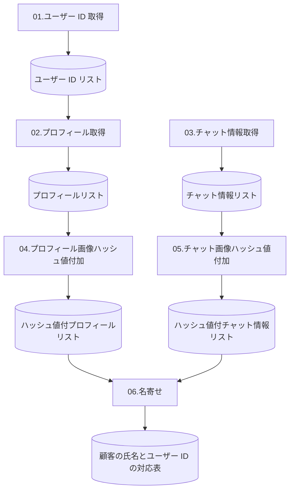

## この記事について

最近、仕事で LINE ボットを開発しているのですがセットアップのために既存 LINE 公式アカウントから友だち一覧を出力する必要があり、この作業になかなか苦戦しました。この記事ではその過程で得られた知見をまとめたいと思います。

### GitHub リポジトリ

この記事の成果物は下記リポジトリで公開しており、MIT ライセンスで利用可能です。

https://github.com/tatsuyasusukida/line-friend-export-v2

### Zenn スクラップ

この記事は下記のスクラップをベースにしています。

https://zenn.dev/tatsuyasusukida/scraps/ab9bf2326b4fce

この記事で不足している情報などがありましたら適宜参照していただければ幸いです。

## ユーザーの呼び方

説明の便宜上、この記事では LINE 公式アカウントを運用するユーザーを「店舗」と呼び、LINE 公式アカウントを友だち登録するユーザーを「顧客」と呼ぶことにします。

## やりたいこと

やりたいことは下記 2 点の対応表を出力することです。

- 顧客ユーザー ID
- 顧客の氏名（店舗側で設定した顧客の表示名）

それぞれについての説明を書いたのですが、かなり長くなってしまったので記事の最後の方に補足としてまとめました。必要に応じて読んでいただければ幸いです。

## 使用する API

やりたいことを実現するために使用する LINE の API を下記に示します。

- 1️⃣ LINE 公式アカウントを友だち追加したユーザーのリストを取得する API
- 2️⃣ ユーザー ID からプロフィール情報を取得する API
- 3️⃣ チャットページからトークできる友だちのリストを取得する API（非公式）

上記のままだとやや長いなのでそれぞれ下記のように呼ぶことにします。

- 1️⃣ ユーザー ID 一覧 API
- 2️⃣ プロフィール詳細 API
- 3️⃣ チャット一覧 API（非公式）

それぞれ 1 つ 1 つ説明していきます。

### 1️⃣ ユーザー ID 一覧 API

LINE 公式アカウントを友だち追加したユーザーのリストを取得するには下記の HTTP リクエストを送信します。

```
GET https://api.line.me/v2/bot/followers/ids
```

HTTP リクエストの詳細については公式ドキュメントがとてもわかりやすいので説明を割愛します。

https://developers.line.biz/ja/reference/messaging-api/#get-follower-ids

1 点だけ注意が必要なのは、この API を利用できるのは「認証済アカウント」または「プレミアムアカウント」のみである点です。認証済アカウントについては下記ページが詳しいです。

https://www.linebiz.com/jp/service/line-official-account/verified-account/

### 2️⃣ プロフィール詳細 API

ユーザー ID からプロフィール情報を取得するには下記の HTTP リクエストを送信します。

```
GET https://api.line.me/v2/bot/profile/{userId}
```

こちらも公式ドキュメントがとてもわかりやすいので説明を割愛します。

https://developers.line.biz/ja/reference/messaging-api/#get-profile

### 3️⃣ チャット一覧 API（非公式）

チャットページからトークできる友だちのリストを取得するには下記の HTTP リクエストを送信します。

```
GET https://chat.line.biz/api/v2/bots/{userId}/chats
```

こちらの API については公式ドキュメントに説明がなく、チャットページで Google Chrome の開発者ツールを使ってネットワークをモニタリングしている時にたまたま見つけたものです。

以下、こちらの API についてわかっていることについて説明します。

#### レート制限

不明ですが他の API と同じであれば 2,000 リクエスト/秒だと思います。

#### リクエストヘッダー

| 名称   | 必須／任意 | 備考                                             |
| ------ | ---------- | ------------------------------------------------ |
| Cookie | 必須       | チャットページで開発者ツールで調べてコピーします |

#### パスパラメーター

| 名称   | 必須／任意 | 備考                                  |
| ------ | ---------- | ------------------------------------- |
| userId | 必須       | チャットページの URL からコピーします |

#### クエリパラメーター

| 名称       | 必須／任意 | 備考                               |
| ---------- | ---------- | ---------------------------------- |
| folderType | 任意       | 例：すべて = `ALL`、受信 = `INBOX` |
| limit      | 任意       | 取得件数の上限、最大 25 件         |
| next       | 任意       | 継続トークン、レスポンスに含まれる |

#### レスポンス

| 名称 | 型     | 備考                                         |
| ---- | ------ | -------------------------------------------- |
| list | Array  | トークできる友だちのリスト                   |
| next | String | 継続トークン、次のデータを取得するために使用 |

```json:レスポンスの例
{
  "list": [
    {
      "chatId": "U11111111111111111111111111111111",
      "updatedAt": 1234567890123,
      "tagIds": [],
      "autoTagIds": [],
      "read": false,
      "done": false,
      "followedUp": false,
      "spam": false,
      "muteAtPc": false,
      "muteAtApp": false,
      "assignedBizId": "00000000-0000-0000-0000-000000000000",
      "profile": {
        "userId": "U11111111111111111111111111111111",
        "name": "達哉",
        "nickname": "薄田　達哉",
        "friend": true,
        "lastActivityExpiresAt": 1234567890123,
        "iconHash": "xxxx"
      },
      "latestEvent": {
        "type": "message",
        "timestamp": 1234567890123,
        "source": {
          "chatId": "U11111111111111111111111111111111",
          "userId": "U11111111111111111111111111111111"
        },
        "message": {
          "id": "123456789012345678",
          "type": "text",
          "text": "ここにメッセージが入ります。"
        }
      },
      "lastReadAt": 1234567890123,
      "userLastReadAt": 1234567890123,
      "lastReceivedAt": 1234567890123,
      "lastSentAt": 1234567890123,
      "lastTalkedAt": 1234567890123,
      "lastReadMessageId": "123456789012345678",
      "userLastReadMessageId": "123456789012345678",
      "chatType": "USER",
      "status": "active"
    }
  ],
  "next": "yyyy"
}
```

レスポンスには `userId` が含まれますが、**これは 1️⃣ ユーザー ID 一覧 API から取得できる userID とは異なるので注意が必要です。**

また、こちらの API は他の 2 つの API のように公式に提供されているものではないため、予告なく変更・廃止される可能性があります。

## 大まかな流れ

やりたいことを実現するための大まかな流れをフローチャートに示します。



前半の下記 3 つの手続きについては API にリクエストを送信するだけなので簡単です。

- 01.ユーザー ID 取得
- 02.プロフィール取得
- 03.チャット情報取得

後半の下記 3 つの手続きについては次のセクションで説明します。

- 04.プロフィール画像ハッシュ値付加
- 05.チャット画像ハッシュ値付加
- 06.名寄せ

## プロフィール画像で名寄せ

今回、最も苦労したことはプロフィールとチャット情報の名寄せ作業です。プロフィールにもチャット情報にも `userId` が含まれますが、同一人物であってもこれらが異なるので他の情報を頼りに顧客の同一性を判断する必要があります。

幸いなことにプロフィールにもチャット情報にも顧客が設定したプロフィール画像に関する画像に関する情報が含まれていたので、プロフィール画像のハッシュ値を同一性の判断に利用できそうでした。結論としては下記 2 つの条件を満たした場合に同一の顧客であると判断することにしました。

- プロフィールの表示名とチャット情報の表示名が同じであること
- プロフィールの画像ハッシュ値とチャット情報の画像ハッシュ値が同じであること

異なる顧客が同じ表示名・同じプロフィール画像を使用している可能性もゼロではないですが、そこは諦めることにしました。

## ソースコード

前置きが長くなってしまいましたが、以下、作成したソースコードについて説明します。説明については主にソースコードにコメントの形で記載します。ソースコードの量はコメントを含めて全体で 400 行くらいです。

プログラミング言語には TypeScript を使用しましたが使い慣れているから使っただけで特別な理由なく、HTTP リクエストが送信できる言語であれば何でも大丈夫です。

### ワークスペース作成

```sh:コマンド
# ディレクトリを作成して移動します。
mkdir line-friend-export
cd line-friend-export

# package.json を作成して npm パッケージをインストールします。
npm init -y
npm install dotenv node-fetch@1
npm install --save-dev ts-node @types/node @types/node-fetch@1

# ソースコードを作成します。
touch .env \
  01.get-follower-ids.ts \
  02.get-profiles.ts \
  03-get-chats.ts \
  04-append-profile-hashes.ts \
  05-append-chat-hashes.ts \
  06-join.ts
```

### 環境変数

```ini:.env
LINE_CHANNEL_ACCESS_TOKEN="xxxx"
LINE_CHAT_ID="U00000000000000000000000000000000"
LINE_CHAT_COOKIE="yyyy=zzzz"
```

`LINE_CHANNEL_ACCESS_TOKEN` は LINE Messaging API のチャネルアクセストークンであり、1️⃣ ユーザー ID 一覧 API と 2️⃣ プロフィール詳細 API を使用するために必要です。取得方法については下記ページがわかりやすいです。

https://programming-zero.net/line-api-channel-access-token/

`LINE_CHAT_ID` と `LINE_CHAT_COOKIE` は 3️⃣ チャット一覧 `API（非公式）を使用するために必要です。LINE_CHAT_ID` は管理画面のチャットページの URL に含まれており、`LINE_CHAT_COOKIE` はブラウザの開発者ツールで調べることができます。

### 01.ユーザー ID 取得

```ts:01.get-follower-ids.ts
import { writeFile } from "fs/promises";
import fetch from "node-fetch";

/**
 * LINE 公式アカウントを友だち追加したユーザーのリストを取得する API レスポンスのデータ型です。
 * https://developers.line.biz/ja/reference/messaging-api/#get-follower-ids
 */
type ResponseBody = {
  userIds: string[];
  next?: string;
};

/**
 * LINE 公式アカウントを友だち追加したユーザーのリストを出力します。
 */
async function getFollowerIds(): Promise<string[]> {
  let userIds: string[] = [];
  let start: string | null = null;

  for (;;) {
    const params = { limit: "1000" };
    const url =
      "https://api.line.me/v2/bot/followers/ids?" +
      new URLSearchParams(start ? { ...params, start } : params).toString();

    const response = await fetch(url, {
      headers: {
        Authorization: `Bearer ${process.env.LINE_CHANNEL_ACCESS_TOKEN}`,
      },
    });

    if (response.status !== 200) {
      console.error(await response.text());
      process.exit(1);
    }

    const responseBody = await response.json<ResponseBody>();

    if (!responseBody.next) {
      break;
    }

    userIds = userIds.concat(responseBody.userIds);
    start = responseBody.next;
  }

  return userIds;
}

async function main() {
  const userIds = await getFollowerIds();

  await writeFile(
    "data-01-follower-ids.json",
    JSON.stringify(userIds, null, 2)
  );
}

main().catch((err) => console.error(err));
```

### 02.プロフィール取得

```ts:02.get-profiles.ts
import { readFile, writeFile } from "fs/promises";
import fetch from "node-fetch";

/**
 * プロフィール情報を取得する API レスポンスのデータ型です。
 * https://developers.line.biz/ja/reference/messaging-api/#get-profile
 */
type ResponseBody = {
  displayName: string;
  userId: string;
  language?: string;
  pictureUrl?: string;
  statusMessage: string;
};

/**
 * ユーザー ID のリストを入力するとプロフィールのリストを出力します。
 */
async function getProfiles(userIds: string[]): Promise<ResponseBody[]> {
  const responseBodies: ResponseBody[] = [];

  for (const userId of userIds) {
    const url = "https://api.line.me/v2/bot/profile/" + userId;
    const response = await fetch(url, {
      headers: {
        Authorization: `Bearer ${process.env.LINE_CHANNEL_ACCESS_TOKEN}`,
      },
    });

    responseBodies.push(await response.json());
  }

  return responseBodies;
}

async function main() {
  const userIds: string[] = JSON.parse(
    await readFile("data-01-follower-ids.json", "utf-8")
  );

  const responseBodies = await getProfiles(userIds);

  await writeFile(
    "data-02-get-profiles.json",
    JSON.stringify(responseBodies, null, 2)
  );
}

main().catch((err) => console.error(err));
```

### 03.チャット情報取得

```ts:03-get-chats.ts
import { writeFile } from "fs/promises";
import fetch from "node-fetch";

/**
 * チャットページからトークできる友だちのリストを取得する API レスポンスのデータ型です。
 * 2023 年 8 月時点では LINE Developers にドキュメントが無い様子です。
 * https://developers.line.biz/ja/docs/
 */
type ResponseBody = {
  list: {
    profile: {
      name?: string;
      nickname?: string;
      iconHash?: string;
    };
  }[];
  next?: string;
};

/**
 * LINE 公式アカウント管理画面のチャットページからトークできる友だちのリストを出力します。
 */
async function getChats(): Promise<ResponseBody["list"]> {
  let responseBodies: ResponseBody["list"] = [];
  let next: string | null = null;

  for (;;) {
    const params = {
      folderType: "ALL",
      limit: "25",
    };

    const url =
      `https://chat.line.biz/api/v2/bots/${process.env.LINE_CHAT_ID}/chats?` +
      new URLSearchParams(next ? { ...params, next } : params).toString();

    const response = await fetch(url, {
      headers: {
        Cookie: process.env.LINE_CHAT_COOKIE!,
      },
    });

    if (response.status !== 200) {
      console.error(await response.text());
      process.exit(1);
    }

    const responseBody = await response.json<ResponseBody>();

    if (!responseBody.next) {
      break;
    }

    responseBodies = responseBodies.concat(responseBody.list);
    next = responseBody.next;
  }

  return responseBodies;
}

async function main() {
  const responseBodies = await getChats();

  await writeFile(
    "data-03-get-chats.json",
    JSON.stringify(responseBodies, null, 2)
  );
}

main().catch((err) => console.error(err));
```

### 04.プロフィール画像ハッシュ値付加

```ts:04-append-profile-hashes.ts
import { createHash } from "crypto";
import { readFile, writeFile } from "fs/promises";
import fetch from "node-fetch";

/**
 * 入力されるプロフィールのデータ型です。
 * 02-get-profiles.ts の出力データ型と同じです。
 */
type InputProfile = {
  displayName: string;
  userId: string;
  language?: string;
  pictureUrl?: string;
  statusMessage: string;
};

/**
 * 出力されるプロフィールのデータ型です。
 */
type OutputProfile = InputProfile & {
  /** プロフィール画像の SHA-256 ハッシュ値です。 */
  imageHash?: string;
};

/**
 * プロフィールのリストを入力するとプロフィール画像の SHA-256 ハッシュ値を付加して出力します。
 */
async function appendProfileHashes(
  inputProfiles: InputProfile[]
): Promise<OutputProfile[]> {
  const outputProfiles: OutputProfile[] = [];

  for (const inputProfile of inputProfiles) {
    if (!inputProfile.pictureUrl) {
      outputProfiles.push(inputProfile);
      continue;
    }

    const response = await fetch(inputProfile.pictureUrl);
    const buffer = await response.buffer();
    const imageHash = createHash("sha256").update(buffer).digest("base64");

    outputProfiles.push({
      ...inputProfile,
      imageHash,
    });
  }

  return outputProfiles;
}

async function main() {
  const inputProfiles: InputProfile[] = JSON.parse(
    await readFile("data-02-get-profiles.json", "utf-8")
  );

  const outputProfiles = await appendProfileHashes(inputProfiles);

  await writeFile(
    "data-04-append-profile-hashes.json",
    JSON.stringify(outputProfiles, null, 2)
  );
}

main().catch((err) => console.error(err));
```

### 05.チャット画像ハッシュ値付加

```ts:05-append-chat-hashes.ts
import { createHash } from "crypto";
import { readFile, writeFile } from "fs/promises";
import fetch from "node-fetch";

/**
 * 入力されるチャット情報のデータ型です。
 * 03-get-chats.ts の出力データ型と同じです。
 */
type InputChat = {
  profile: {
    name?: string;
    nickname?: string;
    iconHash?: string;
  };
};

/**
 * 出力されるチャット情報のデータ型です。
 */
type OutputChat = {
  profile: InputChat["profile"] & {
    /** プロフィール画像の SHA-256 ハッシュ値です。 */
    imageHash?: string;
  };
};

/**
 * チャット情報のリストを入力するとプロフィール画像の SHA-256 ハッシュ値を付加して出力します。
 */
async function appendChatHashes(
  inputChats: InputChat[]
): Promise<OutputChat[]> {
  const outputChats: OutputChat[] = [];

  for (const inputChat of inputChats) {
    if (!inputChat.profile.iconHash) {
      outputChats.push(inputChat);
      continue;
    }

    const url = "https://profile.line-scdn.net/" + inputChat.profile.iconHash;
    const response = await fetch(url);
    const buffer = await response.buffer();
    const imageHash = createHash("sha256").update(buffer).digest("base64");

    outputChats.push({
      ...inputChat,
      profile: {
        ...inputChat.profile,
        imageHash,
      },
    });
  }

  return outputChats;
}

async function main() {
  const inputChats: InputChat[] = JSON.parse(
    await readFile("data-03-get-chats.json", "utf-8")
  );

  const outputChats = await appendChatHashes(inputChats);

  await writeFile(
    "data-05-append-chat-hashes.json",
    JSON.stringify(outputChats, null, 2)
  );
}

main().catch((err) => console.error(err));
```

### 06.名寄せ

```ts:06-join.ts
import { createHash } from "crypto";
import { readFile, writeFile } from "fs/promises";
import fetch from "node-fetch";

/**
 * 入力されるプロフィールのデータ型です。
 * 04-append-profile-hashes.ts の出力データ型と同じです。
 */
type InputProfile = {
  displayName: string;
  userId: string;
  language?: string;
  pictureUrl?: string;
  statusMessage: string;
  imageHash?: string;
};

/**
 * 入力されるチャット情報のデータ型です。
 * 05-append-chat-hashes.ts の出力データ型と同じです。
 */
type InputChat = {
  profile: {
    name?: string;
    nickname?: string;
    iconHash?: string;
    imageHash?: string;
  };
};

/**
 * 出力されるプロフィールのデータ型です。
 */
type OutputProfile = InputProfile & {
  nickname?: string;
};

/**
 * プロフィールとチャット情報を名寄せし、プロフィールにニックネームを付加します。
 * ニックネームとはチャットページで店舗が顧客に設定した名前のことです。
 * 次の 2 つの条件の両方を満たした場合に同一の顧客と判断しています。
 *
 * - プロフィールの表示名とチャット情報の表示名が同じであること
 * - プロフィールの画像ハッシュ値とチャット情報の画像ハッシュ値が同じであること
 */
function join(
  inputProfiles: InputProfile[],
  inputChats: InputChat[]
): OutputProfile[] {
  const outputProfiles: OutputProfile[] = inputProfiles.map((inputProfile) => {
    if (!inputProfile.imageHash) {
      return inputProfile;
    }

    const chats = inputChats.filter((chat) => {
      return (
        chat.profile.name === inputProfile.displayName &&
        chat.profile.imageHash &&
        chat.profile.imageHash === inputProfile.imageHash
      );
    });

    if (chats.length !== 1) {
      return inputProfile;
    }

    return {
      ...inputProfile,
      nickname: chats[0].profile.nickname,
    };
  });

  return outputProfiles;
}

async function main() {
  const inputProfiles: InputProfile[] = JSON.parse(
    await readFile("data-04-append-profile-hashes.json", "utf-8")
  );

  const inputChats: InputChat[] = JSON.parse(
    await readFile("data-05-append-chat-hashes.json", "utf-8")
  );

  const outputProfiles = await join(inputProfiles, inputChats);

  await writeFile("data-06-join.json", JSON.stringify(outputProfiles, null, 2));
}

main().catch((err) => console.error(err));
```

## コード実行

コマンドを下記に示します。

```sh:コマンド
npx ts-node -r dotenv/config 01-get-follower-ids.ts
npx ts-node -r dotenv/config 02-get-profiles.ts
npx ts-node -r dotenv/config 03-get-chats.ts
npx ts-node -r dotenv/config 04-append-profile-hashes.ts
npx ts-node -r dotenv/config 05-append-chat-hashes.ts
npx ts-node -r dotenv/config 06-join.ts
```

最終的に出力される顧客の氏名とユーザー ID の対応表（表ではありませんが...）を下記に示します。

```json:data-06-join.json（例）
[
  {
    "userId": "U11111111111111111111111111111111",
    "displayName": "達哉",
    "pictureUrl": "https://profile.line-scdn.net/0m22222222222222222222222222222222222222222222",
    "language": "ja",
    "imageHash": "3333333333333333333333333333333333333333333=",
    "nickname": "薄田　達哉"
  }
]
```

`userId` が顧客のユーザー ID、`nickname` が顧客の氏名です。

## おわりに

そもそもなぜこのような作業が必要になったかと言うと、LINE ボットを導入するにあたって既存顧客（既に LINE 公式アカウントを友だち登録していて本人確認も済んでいる顧客）が ID 連携する手間を省きたいという要望を店舗側からいただいたことでした。そのためには既存顧客の LINE ID をあらかじめ LINE ボットのデータベースに登録しておく必要があるので LINE 公式アカウントの友だち一覧（顧客の LINE ID と氏名の対応表）を出力することになった次第です。

今回の開発では店舗側に ID 連携のしくみ（例：EC サイトなど）が無く、店舗は顧客とチャットして本人確認 + LINE ID を取得して LINE ボットの管理システムに手動で登録するような運用にしているので結果的に店舗側の負荷削減にもつながりました。

ID 連携は顧客と店舗の双方にとって便利ですが、顧客によっては操作方法がよくわからなくて ID 連携ができないケースもあります。仮に ID 連携のしくみがあった場合でもチャットで本人確認 + LINE ID を取得して店舗側で登録できるようにしておくと良いかも知れないと思いました。

## 補足 1：顧客ユーザー ID

ユーザー ID とはユーザーの一意な識別子であり、ユーザーの表示名や友だち検索に使用する LINE ID とは異なります。ユーザー ID は正規表現 `U[0-9a-f]{32}` にマッチする文字列で、例えば `U12345678901234567890123456789012` のような値になります。ユーザー ID については LINE Developers 公式ドキュメントにも記載があります。

https://developers.line.biz/ja/docs/messaging-api/getting-user-ids/#what-is-user-id

ユーザー ID については 1 つだけ注意する点があります。それは**同じユーザーであってもプロバイダーごとに異なる値が発行される**点です。例えば下記 3 つのケースを考えた場合、成功するのはケース 1 だけです。

- ⭕️ ケース 1：同じプロバイダーに含まれるチャネル C1 と C2 があり、C1 からエクスポートした顧客ユーザー ID を C2 で利用する。
- ❌ ケース 2：あるプロバイダー P1 からエクスポートした顧客ユーザー ID を別のプロバイダー P2 で利用する。
- ❌ ケース 3：ある LINE 公式アカウント A1 からエクスポートした顧客ユーザー ID を別の LINE 公式アカウント A2 で利用する。

プロバイダーとは LINE 公式アカウントを通じてサービスを提供する店舗や企業のことであり、Messaging API などを利用する時に作成する必要があるものです。LINE 公式アカウントとプロバイダーの間には 1 対多の関係があり、プロバイダーとチャネルの間には 1 対多の関係があります。

**既存 LINE 公式アカウントからエクスポートしたユーザー ID を新規に作成する LINE 公式アカウントで利用したいと考えている方は要注意です。**

## 補足 2：顧客の氏名

LINE で顧客が設定した名前は「表示名」と呼ばれます。表示名として本名を設定している方もいますが、それ以外の名前を設定している方も多く、本名で設定していたとしても苗字だけやファーストネームだけのケースもあります。

LINE から提供される情報だけでは顧客が誰かを判断することができないので何らかの手段で本人確認を行う必要があります。本人確認に ID 連携が利用できれば店舗側は手間が少ないのですが、そのようなシステムがない場合はややアナログですがチャットで氏名・住所・生年月日などを確認することになるのではないかと思います。

本人確認が完了した後は「この顧客は ●● さんである」という情報をどこかに保存しておく必要があります。この保存先としてよく使われそうなのが LINE Official Account Manager（管理画面）のチャットページです。このチャットページには「表示名を変更」という便利な機能があり、顧客の氏名などを保存するのに使うことができます。

このように店舗側で設定した表示名は LINE のシステム的には「nickname（ニックネーム）」と呼ばれるようです。ニックネームに本名を保存することになるのでやや紛らわしいですね。
