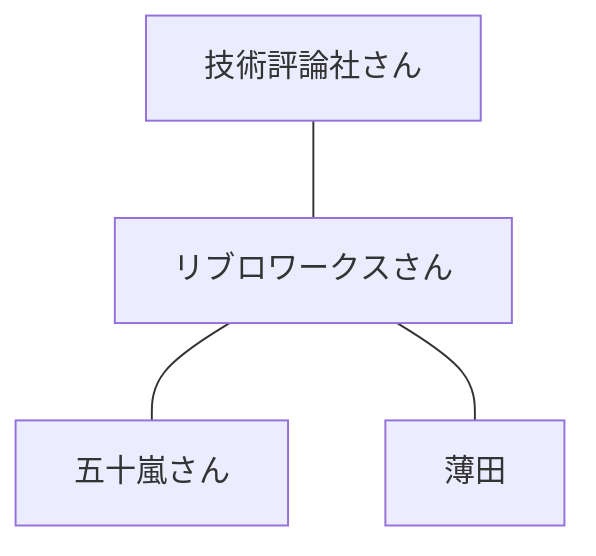
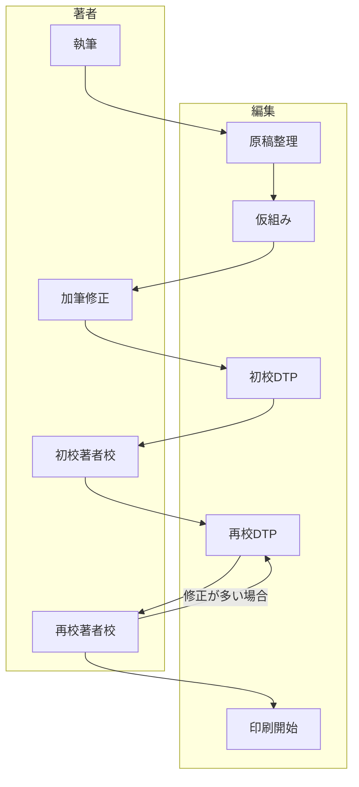

## この記事について

先月2022年11月に私が共著者として関わらせてもらった「[図解即戦力　仮想化＆コンテナがこれ1冊でしっかりわかる教科書](https://gihyo.jp/book/2020/978-4-297-11690-3)」の韓国語翻訳版が出版されました。

https://www.gilbut.co.kr/book/view?bookcode=BN003568&keyword=container&collection=GB_BOOK

図解即戦力は技術評論社の人気シリーズで現時点で66冊の書籍が出版されています。

https://gihyo.jp/book/series?s=%E5%9B%B3%E8%A7%A3%E5%8D%B3%E6%88%A6%E5%8A%9B

この記事では韓国語翻訳版を記念して日本語版の執筆を振り返ってみようと思います。

## きっかけ

きっかけは共著者である[五十嵐貴之](https://www.ikachi.org/profile.html)さんに誘っていただいたことでした。五十嵐さんは多数の技術書籍の執筆している方で、当時はソフトウェア開発会社にエンジニアとしてお勤めでした。私は五十嵐さんが勤務していた会社とお取引があり、五十嵐さんとはメールなどでやり取りしていました。2019年9月に五十嵐さんから「技術評論社からDockerに関する書籍の執筆依頼を受けたのですが協力いただければと思うのですがいかがでしょうか？」との旨のメールをいただき、滅多にないチャンスだと思ってコンテナ技術について何も知らない不安を顧みずに二つ返事で承諾しました。

## 体制

今回の執筆では出版社（技術評論社さん）と著者（五十嵐さんと私）の間に編集プロダクション、略して「編プロ」と呼ばれる会社が入りました。編集プロダクションとは出版社に代わって書籍の企画・編集・マネジメントを担う会社です。入っていただいた編集プロダクションの名前については書籍の最後のページにも書いてあるのですが[リブロワークス](https://libroworks.co.jp/)さんという会社です。

編集プロダクションは必ず入る訳ではなく、著者によっては入らないことの方が多いみたいです。執筆経験が豊富な場合は出版社と直接の方が執筆の自由度が高いので好きな著者もいるそうですが、私は初めての執筆だったので編集プロダクションに入ってもらってありがたいと感じました。

## 役割分担

企画書と目次はリブロワークスさんから提供されました。目次は章節の2段構成で章数は6件、節数は合計57件です。1節のページ数の目安は4ページで図解シリーズなので1ページごとに図表が1つ入ります。文字数はページ内に入る図表の大きさにもよりますが500〜600字程度です。目次をベースに五十嵐さんと話し合って前半24件を五十嵐さん、後半33件を私が担当することになりました。トータルの文字数は33件×4ページ×500〜600字＝66,000〜79,200字でした。

| 章 | タイトル | 節数 | 担当者 |
| ---- | ---- | ---: | ---- |
| 第1章 | 仮想化の基礎知識 | 5件 | 五十嵐さん |
| 第2章 | 仮想化のしくみと技術 | 13件 | 五十嵐さん |
| 第3章 | コンテナ技術の基礎知識 | 6件 | 五十嵐さん |
| 第4章 | コンテナ型仮想化ソフトウェア「Docker」 | 12件 | 薄田 |
| 第5章 | コンテナオーケストレーションツール「Kubernetes」 | 12件 | 薄田 |
| 第6章 | クラウドのコンテナサービス | 9件 | 薄田 |

本文だけではなく図の作成についても五十嵐さんと私の担当でしたが、私たちがパワーポイントなどで描いたポンチ絵をプロのイラストレーターの方がとてもキレイにしてくれました。

## スケジュール

書籍制作の全体の流れは下記の通りです（編集プロダクションの方に教えていただきました）。

それぞれの工程に要した期間は下記の通りです。

| 工程 | 年 | 開始 | 終了 | 期間 |
| ---- | ---- | ---- | ---- | ---- |
| 執筆 | 2019年 | 9月中旬 | 12月末 | 約3.5カ月 |
| 原稿整理・仮組み | 2020年 | 1月上旬 | 7月中旬 | 約6.5カ月 |
| 加筆修正 | 2020年 | 7月中旬 | 7月末 | 約0.5カ月 |
| 初校DTP | 2020年 | 8月上旬 | 9月中旬 | 約1.5カ月 |
| 初校著者校 | 2020年 | 9月中旬 | 9月末 | 約0.5カ月 |
| 再校DTP | 2020年 | 10月初 | 10月上旬 | 約10日 |
| 再校著者校 | 2020年 | 10月上旬 | 10月中旬 | 約5日 |
| 再々校DTP | 2020年 | 10月中旬 | 10月下旬 | 約10日 |
| 再々校著者校 | 2020年 | 10月下旬 | 10月下旬 | 約5日 |
| 印刷開始 | 2020年 | 10月下旬 | 11月上旬 | 約10日 |

原稿整理・仮組みから印刷開始までは早ければ2カ月程度で終わるそうですが、ちょうどコロナの初期で社会全体が停止した時期だったので校了（印刷できる状態になること）まで約10カ月程度を要しました。

### 初めての執筆は大変でした

最初は執筆の勝手がわからずに開始から2カ月が経過した11月10日時点で完了していたのが33件中8件で、期間消費率2カ月÷3.5カ月＝57.1％に対して進捗率8件÷33件＝24.2%と危うい状態でした。さらに私が書籍の主旨を十分に理解してなかったために内容がチュートリアルに偏りすぎており、完了した8件の大部分を修正する必要がありました。

実質1.5カ月で書き上げたようなものですが、その間には本業のソフトウェア開発（しかも炎上気味）に加えて第2子の誕生もあり、今から考えるとよく期限までに書き終えることができたなと冷や汗が出ます。完成した原稿を提出したメールの送信日時が12月31日15時26分、大晦日に「おわったー！おわったー！」とアパートで何度も叫んだ記憶が今も残っています。

## 執筆の進め方

### インプット

執筆を開始してからすぐにDockerとKubernetesに関する技術書籍をそれぞれ1冊ずつ購入して一読しました。一読した理由はDockerやKubernetesの技術について自分の中にメンタルマップを作りたかったのに加えて「他の人はどう書いているんだろう」というのが気になったからです。その後は公式ドキュメントの英語原文をひたすら熟読しました。公式ドキュメント以外のWeb記事も参考にはしましたが、公式ドキュメントと照らし合わせたり実際に手を動かしたりして入念に確認しました。

### アウトプット

本文を書いていくにあたっては下記のような切り口から膨らませていきました。

| 切り口 | 例 |
| ---- | ---- |
| 用語 | Dockerとは何か |
| 構成 | Dockerエンジンの構成 |
| 理由 | Dockerが注目される理由 |
| 違い | コンテナと仮想マシンの違い |
| 特徴 | イメージレイヤーの特徴 |
| コマンド | コンテナの起動／デタッチ／表示／停止／削除 |
| メリット／デメリット | プロセスごとにコンテナを分けるメリット |
| できること／できないこと | Kubernetesができないこと |
| 必要性／重要性 | ポッドの必要性 |
| 使い所／使い分 | サイドカーコンテナの使い所 |

初心者向けにイメージを解説する技術書籍だったので「用語」は特に多めでした。

## 何も知らないのに執筆できたの？

正直に告白すると、執筆依頼を受けた時の私のコンテナ知識はほぼゼロと言っても良い状態でした。Dockerについては主要なコマンドを使ったことがある程度で、Kubernetesについては触ったことすらない状態でした。たまたま初心者向けにイメージを解説する技術書籍だったからどうにかなっただけで運が良かったとしか言いようがありません。

ただ仮に多少知識があったとしてもゼロから学び直す必要があったことに変わりはなかったと思っています。その理由はコンテナ技術をユーザーとして使うのと著者として解説するのとでは異なる種類の知識が必要だからです。例えばユーザーにとってdockerやkubectlコマンドの使い方は重要ですが、コンテナイメージの差分管理などの内部的なしくみについては知らなくてもそれほど困りません。

気持ち的にも何も知らないという自覚があったので謙虚にゼロから学ぶことができましたし、わからない人目線で初心者の方にとってわかりやすく説明できたのではないかと自負しております。ただ詳しく知っているのに越したことはなく、もっとわかりやすく説明できたかも知れないので、表面だけではなく内部のしくみまで普段から深く学ぶ努力をするのが重要だと思いました。

## 執筆して良かった？

結論から言うととても良かったと思います。執筆がきっかけでDockerやKubernetesを仕事でもよく使うようになりコンテナ化の波に乗り遅れずに済んだように感じます。また、人にわかりやすく説明するというスキルを磨くための良い訓練にもなりました。

執筆を無事に終えられたことは自信につながり、人にアピールできる大きな成果のひとつとなりました。何より自分の名前が書いてある本がAmazonやリアルの書店で販売されているのを見ると幸せな気持ちになります。

## 仕事にはつながった？

残念ながら今のところは仕事にはつながっていません。コンテナ技術のコンサルやサポートの案件はそれほど多くはなく、求められる知識も高いので仕事にはつながりにくいと思っています。仮に執筆テーマがAWSやGCPなどのクラウドサービスであればチャンスがあったかも知れません。

## また執筆したい？

ぜひ執筆したいです。知識が無くてとても苦労しましたし、現状では仕事にもつながっていませんが得られたものはとても大きかったと感じています。この記事をお読みの方で出版関係者の方がいましたらお気軽にご用命をいただければ幸いです。

## おわりに

1冊の本を出版するのに多くの人が関わっていることを知り、それが一番勉強になりました。今回の出版で著者として関わらせてもらったことを光栄に思いますし、関わってくださった方々に感謝しています。本を通して読者の方々に少しでも有益な情報を提供できたら嬉しいです。
